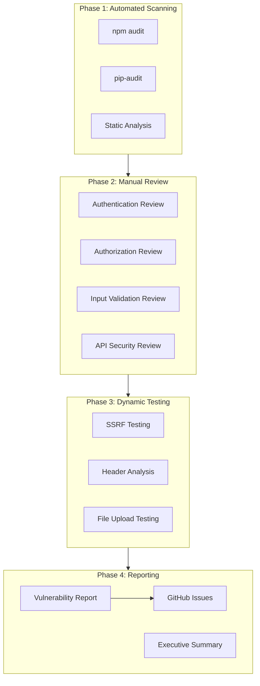
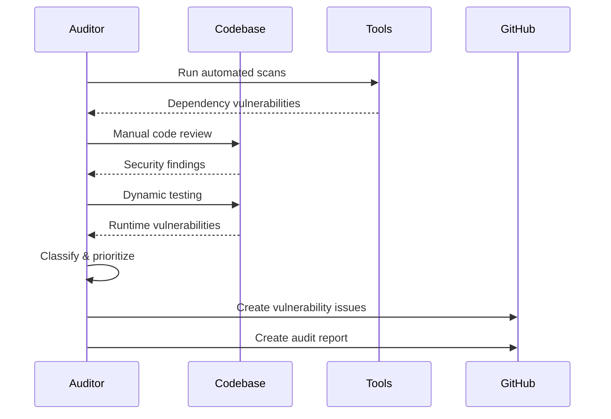
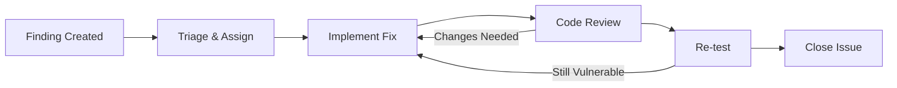

# Design: Issue #8 - Security Audit January 2026

## Overview

This design document defines the methodology, tools, scope, and deliverables for the OptiRoute security audit. The audit follows a systematic approach to identify vulnerabilities across 12 requirement areas, producing actionable findings with severity ratings and remediation guidance.

### Key Design Decisions

1. **Automated + Manual Hybrid Approach**: Combine automated scanning tools (npm audit, static analysis) with manual code review for comprehensive coverage.

2. **Severity-Based Prioritization**: Use CVSS-aligned severity ratings (Critical/High/Medium/Low) to prioritize remediation efforts.

3. **Issue-Per-Vulnerability Tracking**: Create individual GitHub issues for each finding to enable granular tracking and assignment.

4. **Checkpoint-Based Execution**: Structure the audit in phases with checkpoints to allow incremental review and course correction.

5. **Remediation-First Documentation**: Document not just vulnerabilities but specific remediation steps with code examples.

## Audit Architecture



### Audit Workflow



## Scope Definition

### In Scope

| Component | Location | Focus Areas |
|-----------|----------|-------------|
| Web Launcher | `web-launcher/` | Session management, authentication, CORS |
| Dispatch Service | `dispatch-service/` | API authentication, input validation |
| Main API | `src/` | Authorization, database access, file uploads |
| AI Agent | `gradient-agents/` | Prompt injection, data exposure |
| Infrastructure | `.env`, configs | Secrets management, security headers |

### Out of Scope

- Third-party service security (Supabase, Google Maps, Telegram infrastructure)
- Client-side browser security (beyond CSP/headers)
- Network infrastructure and hosting configuration
- Physical security

## Tools and Methodology

### Automated Scanning Tools

| Tool | Purpose | Target |
|------|---------|--------|
| `npm audit` | Dependency vulnerabilities | Node.js packages |
| `pip-audit` | Dependency vulnerabilities | Python packages |
| `eslint-plugin-security` | Static code analysis | JavaScript/TypeScript |
| `bandit` | Static code analysis | Python code |
| `curl` + scripts | Header analysis | HTTP responses |

### Manual Review Checklist

#### Authentication (Requirement 1)
- [ ] Session secret entropy verification
- [ ] Cookie attribute inspection (HttpOnly, Secure, SameSite)
- [ ] Password/credential logging check
- [ ] Rate limiting implementation review
- [ ] Timing attack resistance (constant-time comparison)

#### Authorization (Requirement 2)
- [ ] RLS policy audit for each Supabase table
- [ ] Service role key usage audit
- [ ] Endpoint authentication requirements
- [ ] Public endpoint data exposure check

#### Input Validation (Requirement 3)
- [ ] API parameter validation patterns
- [ ] File upload MIME/magic byte validation
- [ ] UUID format validation
- [ ] SQL/NoSQL injection patterns
- [ ] JSON payload size limits

#### SSRF (Requirement 4)
- [ ] `/api/chat` endpoint URL validation
- [ ] External request timeout configuration
- [ ] Redirect following behavior
- [ ] Internal IP range blocking

#### Secrets (Requirement 5)
- [ ] .gitignore completeness
- [ ] Startup log inspection for secrets
- [ ] Error response content analysis
- [ ] API key transmission method (header vs query)

#### Headers (Requirement 6)
- [ ] CSP policy analysis
- [ ] CORS origin configuration
- [ ] HSTS configuration
- [ ] X-Frame-Options / frame-ancestors

#### File Uploads (Requirement 7)
- [ ] Magic byte validation implementation
- [ ] Image re-encoding for EXIF stripping
- [ ] Filename sanitization
- [ ] Storage bucket policies

#### Database (Requirement 8)
- [ ] Query parameterization audit
- [ ] RLS enablement verification
- [ ] Service role usage justification
- [ ] Soft delete implementation

#### Logging (Requirement 9)
- [ ] Authentication event logging
- [ ] Sensitive field redaction
- [ ] Error response content (production)
- [ ] Audit trail completeness

#### Rate Limiting (Requirement 10)
- [ ] General API rate limits
- [ ] Auth endpoint rate limits
- [ ] Upload rate limits
- [ ] Request body size limits

#### Dependencies (Requirement 11)
- [ ] npm audit results
- [ ] pip-audit results
- [ ] Lock file presence
- [ ] Vulnerability acceptance documentation

## Severity Classification

### CVSS-Aligned Ratings

| Severity | CVSS Score | Criteria | SLA |
|----------|------------|----------|-----|
| **Critical** | 9.0-10.0 | Remote code execution, auth bypass, data breach | Block deployment |
| **High** | 7.0-8.9 | Significant data exposure, privilege escalation | Block deployment |
| **Medium** | 4.0-6.9 | Limited data exposure, requires user interaction | Track for fix |
| **Low** | 0.1-3.9 | Minor information disclosure, defense-in-depth | Track for fix |

### Classification Examples

| Finding | Severity | Rationale |
|---------|----------|-----------|
| SSRF in /api/chat | Critical | Attacker can access internal services |
| Default session secret | Critical | Session forgery possible |
| No login rate limiting | High | Brute force attacks feasible |
| unsafe-inline CSP | High | XSS exploitation easier |
| Permissive CSV MIME type | Medium | Limited attack surface |
| Missing X-Content-Type-Options | Low | Defense-in-depth only |

## Vulnerability Report Structure

### Individual Finding Format

```markdown
## [SEVERITY] Finding Title

**ID:** SEC-2026-001
**Severity:** Critical | High | Medium | Low
**CVSS Score:** X.X
**Status:** Open | In Progress | Resolved | Accepted

### Description
[What the vulnerability is and why it matters]

### Affected Components
- File: `path/to/file.ts`
- Lines: XX-YY
- Endpoint: `/api/endpoint`

### Reproduction Steps
1. Step one
2. Step two
3. Observe vulnerability

### Evidence
[Screenshots, logs, or code snippets demonstrating the issue]

### Remediation
[Specific steps to fix, with code examples]

\`\`\`typescript
// Before (vulnerable)
const secret = process.env.SESSION_SECRET || 'default-secret';

// After (secure)
const secret = process.env.SESSION_SECRET;
if (!secret || secret.length < 32) {
  throw new Error('SESSION_SECRET must be set with minimum 32 characters');
}
\`\`\`

### References
- [OWASP Reference](https://owasp.org/...)
- [CWE-XXX](https://cwe.mitre.org/...)
```

### Executive Summary Format

```markdown
# Security Audit Executive Summary

**Audit Date:** January 2026
**Auditor:** [Name/Team]
**Scope:** OptiRoute Application Stack

## Summary

| Severity | Count | Status |
|----------|-------|--------|
| Critical | X | X open, X resolved |
| High | X | X open, X resolved |
| Medium | X | X open, X resolved |
| Low | X | X open, X resolved |

## Key Findings

1. **[Critical]** Brief description
2. **[High]** Brief description
...

## Recommendations

1. Immediate action items
2. Short-term improvements
3. Long-term security roadmap

## Deployment Readiness

[ ] Ready for production
[X] Blocked - Critical/High issues must be resolved
```

## GitHub Issue Template

```markdown
---
title: "[SEC-2026-XXX] [SEVERITY] Finding Title"
labels: security, severity:critical|high|medium|low
assignees:
---

## Security Finding

**ID:** SEC-2026-XXX
**Severity:** Critical | High | Medium | Low
**Requirement:** #X from requirements.md

### Description
[Description of the vulnerability]

### Affected Code
- [ ] `path/to/file.ts:XX-YY`

### Remediation Steps
- [ ] Step 1
- [ ] Step 2
- [ ] Verify fix

### Acceptance Criteria
- [ ] Vulnerability no longer reproducible
- [ ] Unit test added (if applicable)
- [ ] Code review completed

### References
- Audit Report: `.claude/plans/issue-8-security-audit/findings/SEC-2026-XXX.md`
```

## Remediation Workflow



### Remediation Priority

1. **Critical** - Fix immediately, block all other work
2. **High** - Fix within current sprint, block deployment
3. **Medium** - Schedule for next sprint
4. **Low** - Add to backlog, fix opportunistically

## File Structure

```
.claude/plans/issue-8-security-audit/
├── requirements.md          # Approved requirements
├── design.md               # This document
├── tasks.md                # Implementation tasks
├── findings/               # Individual vulnerability reports
│   ├── SEC-2026-001.md
│   ├── SEC-2026-002.md
│   └── ...
├── report.md               # Executive summary
└── evidence/               # Screenshots, logs, etc.
    ├── npm-audit.json
    ├── header-analysis.txt
    └── ...
```

## Testing Strategy

### Verification Testing

Each remediated vulnerability must be re-tested:

1. **Reproduce Original Issue** - Confirm the vulnerability existed
2. **Apply Fix** - Implement the remediation
3. **Re-test** - Verify the vulnerability is resolved
4. **Regression Check** - Ensure fix doesn't break functionality

### Automated Regression

Add security-focused tests where applicable:

```typescript
// Example: Session secret validation test
describe('Security: Session Configuration', () => {
  it('should reject weak session secrets', () => {
    process.env.SESSION_SECRET = 'weak';
    expect(() => validateSessionConfig()).toThrow();
  });

  it('should accept strong session secrets', () => {
    process.env.SESSION_SECRET = crypto.randomBytes(32).toString('hex');
    expect(() => validateSessionConfig()).not.toThrow();
  });
});
```

## Success Criteria

The audit is complete when:

1. All 12 requirement areas have been reviewed
2. All findings are documented with severity ratings
3. GitHub issues created for all findings
4. Critical and High issues are resolved or have documented acceptance
5. Executive summary report is published
6. Re-testing confirms remediation effectiveness
