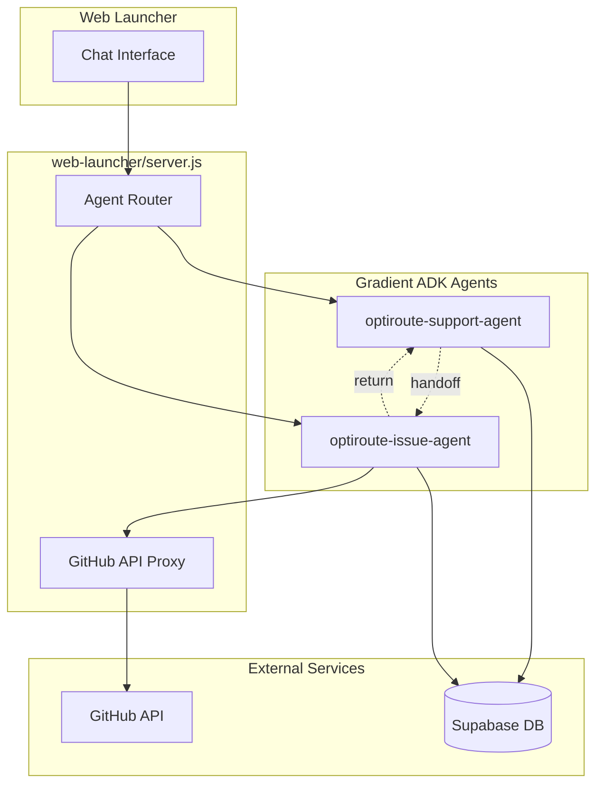
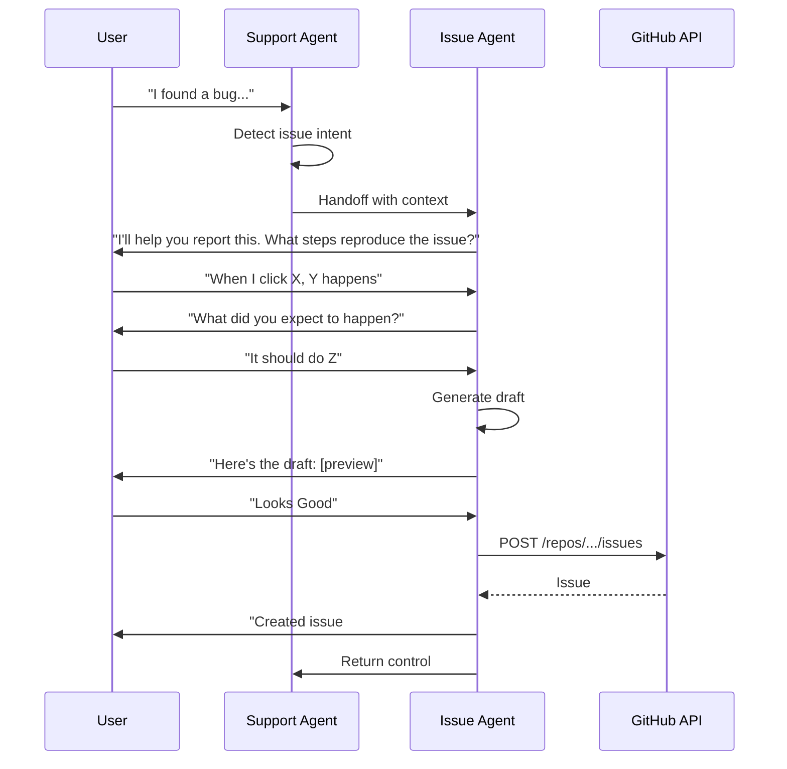

# Design: Issue #10 - AI Assistant GitHub Issues Support

## Overview

This design extends the OptiRoute ecosystem with a dedicated **Issue Agent** (`optiroute-issue-agent`) that handles GitHub issue creation workflows. The main support agent detects issue intent and hands off to the specialized issue agent, which guides users through gathering details, previewing drafts, and submitting issues.

### Key Design Decisions

1. **Sub-Agent Architecture**: A dedicated `optiroute-issue-agent` handles issue creation, keeping the main support agent focused on its core task. This avoids prompt bloat and mode confusion.

2. **Intent-Based Handoff**: The main agent detects issue-related intent (or user clicks "I have an issue") and transfers control to the issue agent with conversation context.

3. **Tool-based GitHub Integration**: GitHub operations implemented as a separate tool class (`GitHubTool`) accessible by the issue agent.

4. **Server-side GitHub Proxy**: API calls route through the web-launcher server to protect the GitHub PAT from client exposure.

5. **Quick Reply Bubbles**: Selectable text bubbles for clear action options ("I have an issue", "Looks Good") to streamline the workflow.

## Architecture



### Agent Handoff Flow



## Prompt Design

### Main Agent: Intent Detection Addition

Add to the existing `optiroute-support-agent/main.py` system prompt:

```python
ISSUE_DETECTION_PROMPT = """
## ISSUE DETECTION

When users express frustration, report problems, or request features, recognize the intent:

**BUG/PROBLEM indicators:**
- "...isn't working", "...is broken", "found a bug", "there's an error"
- "when I try to X, it does Y", "something's wrong with"

**FEATURE REQUEST indicators:**
- "I wish it could", "can you add", "it would be nice if", "feature request"

**When detected OR user clicks "I have an issue":**
1. Acknowledge: "I can help you submit that as a [bug report/feature request]."
2. Return handoff response: `{"handoff": "issue-agent", "context": {...}}`

DO NOT attempt to gather issue details yourself - hand off to the issue agent.
"""
```

### Issue Agent: Full System Prompt

New file: `gradient-agents/optiroute-issue-agent/main.py`

```python
SYSTEM_PROMPT = """
You are the OptiRoute Issue Agent. Your ONLY job is to help users create GitHub issues.

## YOUR WORKFLOW

1. **CLASSIFY** - Determine issue type from context:
   - Bug: Something isn't working as expected
   - Enhancement: Request for new functionality
   - Question: Needs clarification (rare - usually handled by support agent)

2. **GATHER** - Collect details conversationally:
   For BUGS ask:
   - What were you trying to do?
   - What happened instead?
   - Can you describe the steps to reproduce?
   
   For FEATURES ask:
   - What would you like the system to do?
   - How would this help you?

3. **DRAFT** - Generate issue preview:
   Format the issue in markdown, show to user, ask "Does this look good?"

4. **SUBMIT** - On approval, call create_github_issue tool

5. **CONFIRM** - Provide issue number and link, offer to report another or return

## RESPONSE RULES

- Keep responses SHORT (2-3 sentences max)
- Ask ONE question at a time
- Accept partial info - don't force all fields
- If user says "skip" or gives minimal detail, proceed with what you have
- NEVER mention tools or internal processes to the user

## ISSUE TEMPLATE

```markdown
## Description
[User's description]

## Steps to Reproduce (for bugs)
1. [Step 1]
2. [Step 2]

## Expected Behavior
[What should happen]

## Actual Behavior  
[What actually happens]

## Additional Context
[Any extra details]

---
*Submitted via OptiRoute Assistant*
```
"""
```

### Handoff Protocol

The router detects handoff signals in agent responses:

```json
// Support agent returns this to trigger handoff
{
    "handoff": "issue-agent",
    "context": {
        "detected_type": "bug",
        "initial_description": "The login button doesn't work on mobile"
    }
}

// Issue agent returns this when complete
{
    "handoff": "support-agent",
    "result": {
        "issue_created": true,
        "issue_number": 123
    }
}
```


## Components and Interfaces

### GitHubTool Class

New file: `gradient-agents/optiroute-support-agent/tools/github.py`

```python
class GitHubTool:
    """GitHub API integration for issue management."""
    
    def __init__(self):
        self.api_base = os.environ.get("GITHUB_API_PROXY_URL")
        self.repo = os.environ.get("GITHUB_REPO", "imagicrafter/optiroute")
    
    def create_issue(
        self, 
        title: str, 
        body: str, 
        labels: List[str],
        metadata: Dict
    ) -> Dict:
        """Create a GitHub issue. Returns issue number and URL."""
        
    def get_issue(self, issue_number: int) -> Dict:
        """Get issue details including status and comments."""
        
    def list_user_issues(self, user_id: str) -> List[Dict]:
        """List issues created by this user (via stored mapping)."""
```

### Updated Agent Tools Schema

Add to `TOOLS_SCHEMA` in `main.py`:

```python
{
    "type": "function",
    "function": {
        "name": "create_github_issue",
        "description": "Create a GitHub issue for bug reports or feature requests",
        "parameters": {
            "type": "object",
            "properties": {
                "title": {"type": "string"},
                "body": {"type": "string"},
                "issue_type": {"type": "string", "enum": ["bug", "enhancement", "question"]}
            },
            "required": ["title", "body", "issue_type"]
        }
    }
},
{
    "type": "function",
    "function": {
        "name": "get_issue_status",
        "description": "Get the current status of a GitHub issue",
        "parameters": {
            "type": "object",
            "properties": {
                "issue_number": {"type": "integer"}
            },
            "required": ["issue_number"]
        }
    }
}
```

### GitHub API Proxy Endpoint

Add to `web-launcher/server.js`:

```javascript
// POST /api/github/issues - Create issue
app.post('/api/github/issues', async (req, res) => {
    const { title, body, labels } = req.body;
    // Validate, sanitize, call GitHub API with server-side token
});

// GET /api/github/issues/:number - Get issue status
app.get('/api/github/issues/:number', async (req, res) => {
    // Fetch issue from GitHub API
});
```

## Data Models

### Issue Creation State (In-Memory)

```python
@dataclass
class IssueCreationState:
    stage: str  # "detecting", "gathering", "drafting", "confirming", "created"
    issue_type: str  # "bug", "enhancement", "question"
    title: Optional[str]
    description: Optional[str]
    steps_to_reproduce: Optional[str]
    expected_behavior: Optional[str]
    actual_behavior: Optional[str]
    additional_context: Optional[str]
    created_issue_number: Optional[int]
```

### User-Issue Mapping (Database)

```sql
-- New table in Supabase (routeiq schema)
CREATE TABLE routeiq.user_issue_mappings (
    id UUID PRIMARY KEY DEFAULT gen_random_uuid(),
    conversation_id TEXT NOT NULL,
    github_issue_number INTEGER NOT NULL,
    issue_type TEXT NOT NULL,
    created_at TIMESTAMPTZ DEFAULT NOW()
);

CREATE INDEX idx_user_issue_conv ON routeiq.user_issue_mappings(conversation_id);

-- Grant access to existing roles
GRANT SELECT, INSERT ON routeiq.user_issue_mappings TO authenticated;
GRANT SELECT ON routeiq.user_issue_mappings TO optiroute_viewer;
```

## API Design

### POST /api/github/issues

Create a new GitHub issue.

**Request:**
```json
{
    "title": "Login button not working on mobile",
    "body": "## Description\n\nThe login button is unresponsive...",
    "labels": ["bug", "user-submitted"],
    "conversation_id": "abc123"
}
```

**Response (201):**
```json
{
    "success": true,
    "issue": {
        "number": 123,
        "url": "https://github.com/imagicrafter/optiroute/issues/123",
        "state": "open"
    }
}
```

**Error (4xx/5xx):**
```json
{
    "success": false,
    "error": {
        "code": "RATE_LIMITED",
        "message": "GitHub API rate limit reached. Try again in 5 minutes."
    }
}
```

### GET /api/github/issues/:number

Get issue status.

**Response (200):**
```json
{
    "number": 123,
    "title": "Login button not working",
    "state": "open",
    "labels": ["bug", "in-progress"],
    "created_at": "2026-01-19T00:00:00Z",
    "updated_at": "2026-01-19T12:00:00Z",
    "comments_count": 2,
    "last_comment_summary": "Developer is investigating..."
}
```

## Error Handling

| Error Code | HTTP Status | Description |
|------------|-------------|-------------|
| VALIDATION_ERROR | 400 | Missing or invalid issue fields |
| RATE_LIMITED | 429 | GitHub API rate limit exceeded |
| AUTH_ERROR | 401 | GitHub token invalid or expired |
| NOT_FOUND | 404 | Issue number not found |
| GITHUB_ERROR | 502 | GitHub API returned an error |

## Quick Reply Bubbles (UI Component)

To streamline user interactions and capture clear intent, the chat interface displays selectable quick reply bubbles at key workflow stages. Keep bubbles minimal - users will type if they need something different.

### Welcome Message Bubbles

Displayed after the initial assistant greeting:

```json
{
    "quick_replies": [
        { "label": "I have an issue", "action": "report_issue" },
        { "label": "Request a feature", "action": "request_feature" },
        { "label": "Check issue status", "action": "check_status" }
    ]
}
```

### Draft Review Bubbles

Shown after presenting the issue draft:

```json
{
    "quick_replies": [
        { "label": "✓ Looks Good", "action": "confirm_submit" }
    ]
}
```

### Post-Submission Bubbles

Shown after successful issue creation:

```json
{
    "quick_replies": [
        { "label": "Report Another Issue", "action": "report_issue" },
        { "label": "Done", "action": "end_flow" }
    ]
}
```

### Implementation Notes

- Quick replies are rendered as styled buttons/chips below the assistant message
- Clicking a bubble sends the label text as a user message
- The `action` field helps the agent recognize programmatic intent vs. typed text
- Bubbles disappear after selection or when new message is sent

## Testing Strategy

### Unit Tests
- `GitHubTool.create_issue()` - Mock API, verify payload formatting
- `GitHubTool.get_issue()` - Mock API, verify response parsing
- Intent detection patterns - Test against sample inputs

### Integration Tests
- End-to-end issue creation flow with mocked GitHub API
- Conversation state persistence across turns
- Error handling and retry logic

### Manual Verification
- Create a real bug report through chat interface
- Verify issue appears in GitHub with correct labels
- Query issue status after creation
