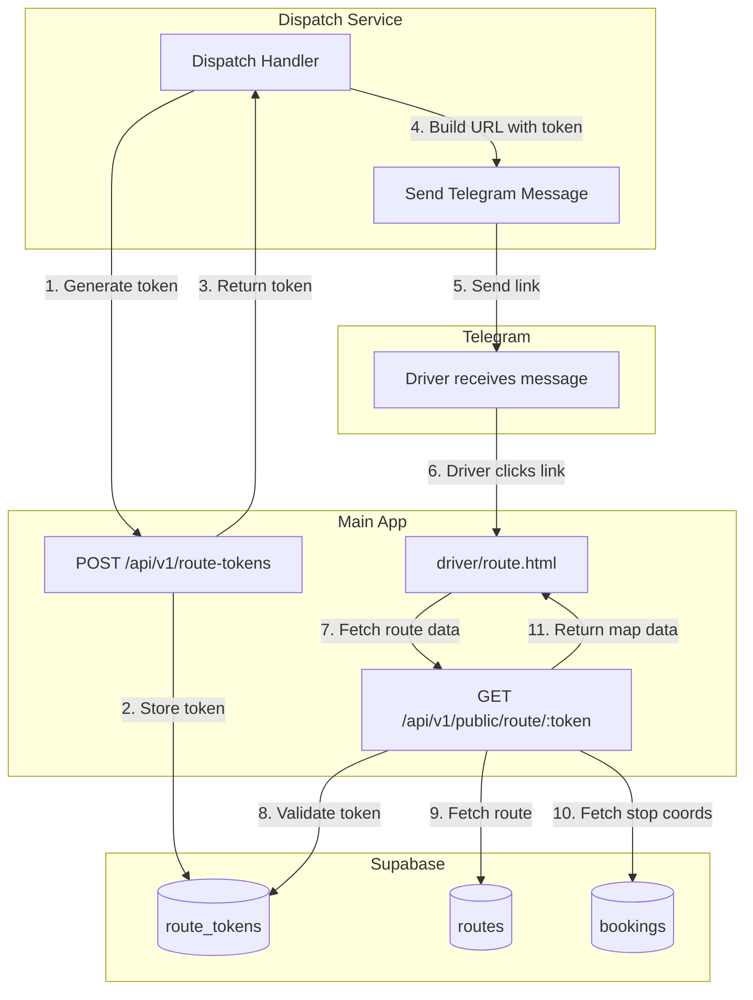
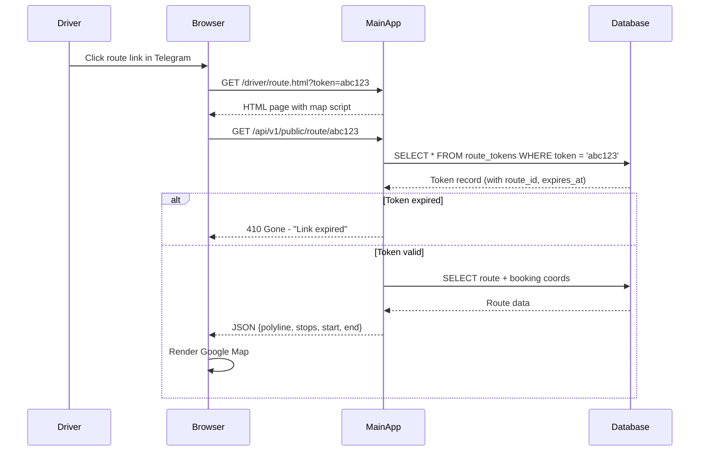

# Design: Issue #103 - Public Driver Route View

## Overview

This design creates a lightweight, public route map view for drivers. The solution adds:
1. A `route_tokens` table to store time-limited access tokens
2. A public API endpoint to fetch route map data by token
3. A standalone HTML page that renders a full-screen Google Map

The architecture prioritizes simplicity - reusing existing map rendering patterns from `routes.html` while stripping away admin UI elements.

### Key Design Decisions

1. **Token storage in database vs JWT**: Database tokens allow revocation and explicit expiration queries. JWTs would require blacklisting logic for early revocation.

2. **Separate HTML page vs query parameter mode**: A dedicated `/driver/route.html` page is cleaner than adding a `?mode=public` flag to the existing routes.html, avoiding conditional logic pollution.

3. **Token generation at dispatch time**: Tokens are created when the route is dispatched, not on-demand. This ensures the link in the Telegram message is immediately valid.

4. **Minimal data exposure**: The public endpoint returns only coordinates and polyline - no customer names, addresses, or booking details.

## Architecture



### Request Flow



## Components and Interfaces

### Route Token Service

New service to manage route access tokens.

```typescript
// src/services/route-token.service.ts

interface RouteToken {
  id: string;
  route_id: string;
  token: string;
  expires_at: Date;
  created_at: Date;
}

interface CreateTokenInput {
  route_id: string;
}

interface RouteTokenService {
  /**
   * Create a new access token for a route
   * Token expires 24 hours from creation
   */
  createToken(input: CreateTokenInput): Promise<RouteToken>;

  /**
   * Validate token and return associated route_id
   * Throws if token invalid or expired
   */
  validateToken(token: string): Promise<{ route_id: string }>;

  /**
   * Delete expired tokens (older than 7 days past expiration)
   */
  cleanupExpiredTokens(): Promise<number>;
}
```

### Public Route Data Service

Service to fetch minimal route data for public display.

```typescript
// src/services/public-route.service.ts

interface StopCoordinate {
  sequence: number;
  lat: number;
  lng: number;
}

interface PublicRouteData {
  polyline: string;           // Encoded route geometry
  stops: StopCoordinate[];    // Numbered stop positions
  start: { lat: number; lng: number };
  end: { lat: number; lng: number };
}

interface PublicRouteService {
  /**
   * Get minimal route data for map display
   * Returns only coordinates, no sensitive data
   */
  getRouteMapData(routeId: string): Promise<PublicRouteData>;
}
```

### API Endpoints

#### POST /api/v1/route-tokens (Protected)

Creates a new route access token. Protected by dispatch API key.

```typescript
// Request
interface CreateTokenRequest {
  route_id: string;
}

// Response (201 Created)
interface CreateTokenResponse {
  token: string;
  expires_at: string;  // ISO datetime
  url: string;         // Full URL: {APP_BASE_URL}/driver/route.html?token={token}
}
```

#### GET /api/v1/public/route/:token (Public)

Fetches route map data by token. No authentication required.

```typescript
// Response (200 OK)
interface PublicRouteResponse {
  polyline: string;
  stops: Array<{
    sequence: number;
    lat: number;
    lng: number;
  }>;
  start: { lat: number; lng: number };
  end: { lat: number; lng: number };
}

// Error Responses
// 404 Not Found - Invalid token
// 410 Gone - Expired token
```

## Data Models

### Database Schema

```sql
-- New table for route access tokens
CREATE TABLE route_tokens (
  id UUID PRIMARY KEY DEFAULT gen_random_uuid(),
  route_id UUID NOT NULL REFERENCES routes(id) ON DELETE CASCADE,
  token UUID NOT NULL UNIQUE DEFAULT gen_random_uuid(),
  expires_at TIMESTAMPTZ NOT NULL,
  created_at TIMESTAMPTZ NOT NULL DEFAULT NOW()
);

-- Index for token lookups
CREATE INDEX idx_route_tokens_token ON route_tokens(token);

-- Index for cleanup queries
CREATE INDEX idx_route_tokens_expires_at ON route_tokens(expires_at);
```

### TypeScript Types

```typescript
// src/types/route-token.ts

export interface RouteToken {
  id: string;
  route_id: string;
  token: string;
  expires_at: Date;
  created_at: Date;
}

export interface CreateRouteTokenInput {
  route_id: string;
}

export interface PublicRouteMapData {
  polyline: string;
  stops: StopCoordinate[];
  start: Coordinates;
  end: Coordinates;
}

interface StopCoordinate {
  sequence: number;
  lat: number;
  lng: number;
}

interface Coordinates {
  lat: number;
  lng: number;
}
```

## Frontend Design

### Page: /driver/route.html

A minimal, standalone HTML page with embedded JavaScript. No build process required - follows existing pattern in `web-launcher/public/`.

```
┌─────────────────────────────────────┐
│                                     │
│                                     │
│                                     │
│          Full-Screen Map            │
│     (Google Maps, dark theme)       │
│                                     │
│    ● Start (green)                  │
│    ❶❷❸... Stops (red numbered)     │
│    ━━━ Route polyline (green)       │
│    ● End (red, if different)        │
│                                     │
│                                     │
│                                     │
└─────────────────────────────────────┘
```

**Key characteristics:**
- No header, sidebar, or navigation
- Map fills entire viewport (100vw × 100vh)
- Touch gestures enabled (pinch zoom, pan)
- Error states displayed as centered message overlay

### Error States

| State | Display |
|-------|---------|
| Missing token | "Invalid route link" centered on gray background |
| Invalid token | "Invalid route link" centered on gray background |
| Expired token | "This route link has expired" centered on gray background |
| Network error | "Unable to load route. Please try again." with retry button |

### Map Styling

Reuse existing dark theme from `routes.html`:
- Background: Dark gray (#242f3e)
- Roads: Lighter gray
- Labels: White/light text
- Polyline: Green (#00ff00 or similar)
- Stop markers: Red with white numbers
- Start marker: Green circle
- End marker: Red circle

## Dispatch Service Integration

### Template Changes

Update `dispatch-service/src/core/templates.ts` to call the token API:

```typescript
// Before building the Telegram message context:
const tokenResponse = await fetch(`${mainAppUrl}/api/v1/route-tokens`, {
  method: 'POST',
  headers: {
    'Content-Type': 'application/json',
    'X-API-Key': dispatchApiKey
  },
  body: JSON.stringify({
    route_id: route.id
  })
});

const { url: routeMapsUrl } = await tokenResponse.json();

// Use routeMapsUrl in template context (replaces current direct URL)
```

### Fallback Behavior

If token generation fails:
1. Log error with route details
2. Fail the dispatch with error message
3. Do NOT fall back to unauthenticated URL (security risk)

## Error Handling

| Error | HTTP Status | User Message |
|-------|-------------|--------------|
| Token not found | 404 | "Invalid route link" |
| Token expired | 410 | "This route link has expired" |
| Route not found | 404 | "Invalid route link" |
| Database error | 500 | "Unable to load route" |
| Token creation fails | 500 | Dispatch fails with error |

## Security Considerations

1. **Token entropy**: UUID v4 provides 122 bits of randomness - sufficient for time-limited tokens
2. **No sensitive data**: Public endpoint returns only coordinates, not customer information
3. **Automatic expiration**: Tokens expire 24 hours after creation
4. **Cascade delete**: Tokens deleted when route is deleted
5. **Rate limiting**: Consider adding rate limiting to public endpoint (not in initial scope)

## Testing Strategy

### Unit Tests

- **RouteTokenService**
  - Creates token with correct expiration (creation time + 24h)
  - Validates unexpired token
  - Rejects expired token with appropriate error
  - Rejects non-existent token
  - Cleanup deletes only tokens expired > 7 days

- **PublicRouteService**
  - Returns correct coordinates for route
  - Returns stops in sequence order
  - Handles routes with no geometry gracefully

### Integration Tests

- POST /api/v1/route-tokens
  - Creates token and returns URL
  - Rejects requests without API key
  - Returns 404 for non-existent route

- GET /api/v1/public/route/:token
  - Returns map data for valid token
  - Returns 404 for invalid token
  - Returns 410 for expired token

### Manual Testing

- Verify map renders correctly on iOS Safari
- Verify map renders correctly on Android Chrome
- Verify pinch-zoom works on mobile
- Verify error states display correctly
