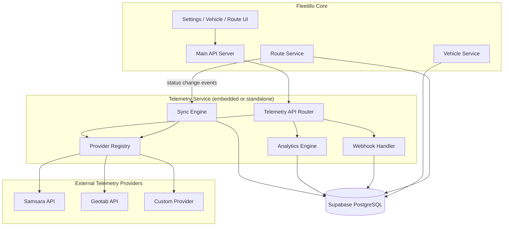
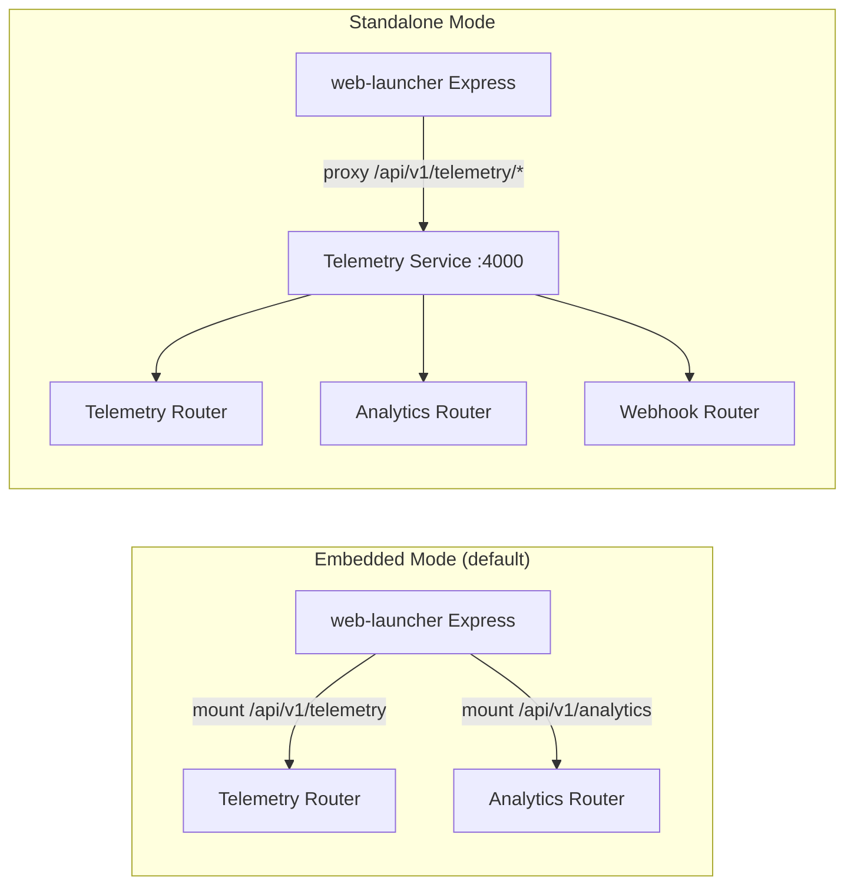
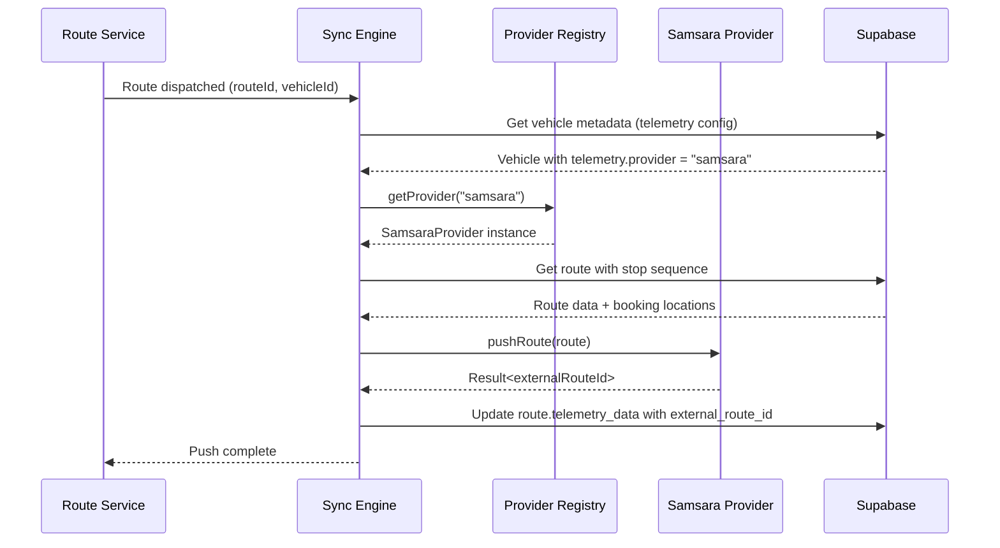
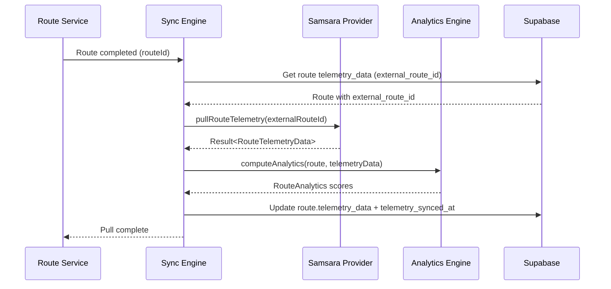

# Design: Issue #143 - Telemetry Integration

## Overview

This design implements a provider-agnostic telemetry integration framework for Fleetillo, enabling comparison of planned routes against actual vehicle tracking data from third-party systems. The architecture follows the existing dispatch-service pattern for embedded/standalone deployment and the locations metadata JSONB pattern for flexible data storage.

### Key Design Decisions

1. **Separate service directory (`telemetry-service/`)**: Follows the dispatch-service pattern, enabling embedded mode (mounted in web-launcher) and standalone mode (own Express server). This provides scalability for high-volume GPS/webhook data without impacting core route planning.

2. **Abstract provider interface with registry**: A `TelemetryProvider` abstract class defines the contract; concrete implementations (Samsara, Geotab, etc.) are registered at startup. This avoids provider-specific code leaking into core business logic.

3. **JSONB metadata columns (not separate tables)**: Store telemetry mappings in existing `vehicles.metadata` and new `drivers.metadata` columns, and telemetry execution data in new `routes.telemetry_data`. This follows the proven locations metadata pattern and avoids schema proliferation.

4. **Event-driven sync with manual fallback**: Route status changes (dispatched → push, completed → pull) trigger automatic sync. Manual endpoints and retry queues handle failures gracefully.

5. **Analytics computed on sync, cached in JSONB**: Analytics are computed when telemetry data is pulled and stored alongside the raw data in `routes.telemetry_data.analytics`. This avoids expensive recomputation on every read.

6. **Shared database, own connection pool**: The telemetry service shares the Supabase database but manages its own connection pool to avoid starving the main app during high-frequency operations.

## Architecture

### System Overview



### Deployment Modes



### Request Flow: Route Push



### Request Flow: Telemetry Pull



## Components and Interfaces

### 1. Abstract TelemetryProvider

The base contract all providers must implement.

```typescript
// telemetry-service/src/core/telemetry-provider.ts

export interface HealthStatus {
  provider: string;
  connected: boolean;
  lastChecked: Date;
  error?: string;
}

export interface VehicleSyncResult {
  externalId: string;
  name: string;
  vin?: string;
  licensePlate?: string;
  matched: boolean;
  fleetilloVehicleId?: string;
}

export interface DriverSyncResult {
  externalId: string;
  name: string;
  email?: string;
  matched: boolean;
  fleetilloDriverId?: string;
}

export interface LocationPoint {
  lat: number;
  lng: number;
  timestamp: string;
  speed?: number;
  heading?: number;
}

export interface DateRange {
  start: Date;
  end: Date;
}

export abstract class TelemetryProvider {
  abstract readonly name: string;

  // Health
  abstract healthCheck(): Promise<Result<HealthStatus>>;

  // Vehicle operations
  abstract syncVehicles(): Promise<Result<VehicleSyncResult[]>>;
  abstract getVehicleLocation(externalId: string): Promise<Result<LocationPoint>>;

  // Driver operations
  abstract syncDrivers(): Promise<Result<DriverSyncResult[]>>;

  // Route operations
  abstract pushRoute(route: RouteWithStops): Promise<Result<string>>;
  abstract pullRouteTelemetry(externalRouteId: string): Promise<Result<RouteTelemetryData>>;
}
```

### 2. Provider Registry

Manages provider instances and routes operations to the correct provider.

```typescript
// telemetry-service/src/core/provider-registry.ts

export interface ProviderRegistryInterface {
  register(provider: TelemetryProvider): void;
  get(name: string): TelemetryProvider | undefined;
  getAll(): TelemetryProvider[];
  has(name: string): boolean;
}
```

### 3. Sync Engine

Orchestrates push/pull operations triggered by route status changes.

```typescript
// telemetry-service/src/core/sync-engine.ts

export interface SyncEngineInterface {
  // Push planned route to provider
  pushRoute(routeId: string): Promise<Result<void>>;

  // Pull telemetry data from provider
  pullRouteTelemetry(routeId: string): Promise<Result<void>>;

  // Sync vehicles from provider
  syncProviderVehicles(providerName: string): Promise<Result<VehicleSyncResult[]>>;

  // Sync drivers from provider
  syncProviderDrivers(providerName: string): Promise<Result<DriverSyncResult[]>>;

  // Retry failed syncs
  retryFailedSyncs(): Promise<Result<void>>;
}
```

### 4. Analytics Engine

Computes comparison metrics between planned and actual route data.

```typescript
// telemetry-service/src/core/analytics-engine.ts

export interface AnalyticsEngineInterface {
  // Compute analytics for a single route
  computeRouteAnalytics(
    route: Route,
    telemetryData: RouteTelemetryData
  ): RouteAnalytics;

  // Aggregate analytics across routes for a date range
  getRouteSummary(dateRange: DateRange): Promise<Result<AggregateSummary>>;

  // Get driver performance metrics
  getDriverPerformance(
    driverId: string,
    dateRange: DateRange
  ): Promise<Result<DriverPerformanceMetrics>>;
}

export interface AggregateSummary {
  totalRoutes: number;
  routesWithTelemetry: number;
  avgAdherenceScore: number;
  avgEfficiencyScore: number;
  totalDistanceVarianceKm: number;
  totalDurationVarianceMinutes: number;
  topPerformingDrivers: Array<{ driverId: string; score: number }>;
}

export interface DriverPerformanceMetrics {
  driverId: string;
  routeCount: number;
  avgAdherenceScore: number;
  avgEfficiencyScore: number;
  totalHarshBraking: number;
  totalHarshAcceleration: number;
  totalSpeedingIncidents: number;
  avgDistanceVariancePercent: number;
  avgDurationVariancePercent: number;
}
```

### 5. Samsara Provider (Initial Implementation)

```typescript
// telemetry-service/src/providers/samsara/samsara-provider.ts

export class SamsaraProvider extends TelemetryProvider {
  readonly name = 'samsara';

  constructor(private readonly config: SamsaraConfig) {
    super();
  }

  // All abstract methods implemented using Samsara REST API
  // Uses SamsaraApiClient for HTTP communication
}

// telemetry-service/src/providers/samsara/samsara-api-client.ts

export interface SamsaraConfig {
  apiUrl: string;       // https://api.samsara.com
  apiToken: string;     // From env: SAMSARA_API_TOKEN
  organizationId: string;
}

export class SamsaraApiClient {
  constructor(private readonly config: SamsaraConfig) {}

  async getVehicles(): Promise<Result<SamsaraVehicle[]>>;
  async getDrivers(): Promise<Result<SamsaraDriver[]>>;
  async createRoute(route: SamsaraRouteInput): Promise<Result<SamsaraRoute>>;
  async getRouteUpdates(routeId: string): Promise<Result<SamsaraRouteUpdate[]>>;
  async getVehicleLocations(vehicleId: string, dateRange: DateRange): Promise<Result<SamsaraLocation[]>>;
}
```

### 6. Telemetry API Router

```typescript
// telemetry-service/src/api/telemetry-routes.ts

// Provider management
// GET  /api/v1/telemetry/status              → getProviderStatus
// POST /api/v1/telemetry/providers/:provider/sync/vehicles → syncVehicles
// POST /api/v1/telemetry/providers/:provider/sync/drivers  → syncDrivers

// Vehicle/Driver telemetry config
// PUT  /api/v1/vehicles/:id/telemetry        → configureVehicleTelemetry
// PUT  /api/v1/drivers/:id/telemetry         → configureDriverTelemetry

// Route telemetry
// GET  /api/v1/routes/:id/telemetry          → getRouteTelemetry
// POST /api/v1/routes/:id/telemetry/push     → pushRouteToProvider
// POST /api/v1/routes/:id/telemetry/sync     → pullRouteTelemetry

// Analytics
// GET  /api/v1/analytics/routes/:id          → getRouteAnalytics
// GET  /api/v1/analytics/summary             → getAggregateSummary
// GET  /api/v1/analytics/drivers/:id         → getDriverPerformance

// Webhooks
// POST /api/v1/webhooks/telemetry/:provider/routes    → handleRouteWebhook
// POST /api/v1/webhooks/telemetry/:provider/locations → handleLocationWebhook
```

### 7. Service Directory Structure

```
telemetry-service/
├── src/
│   ├── api/
│   │   ├── telemetry-routes.ts      # Express router definitions
│   │   ├── telemetry-controller.ts  # Request handlers (thin)
│   │   ├── analytics-routes.ts      # Analytics router
│   │   ├── analytics-controller.ts  # Analytics handlers
│   │   └── webhook-controller.ts    # Webhook handlers
│   ├── core/
│   │   ├── telemetry-provider.ts    # Abstract base class
│   │   ├── provider-registry.ts     # Provider management
│   │   ├── sync-engine.ts           # Push/pull orchestration
│   │   └── analytics-engine.ts      # Metrics computation
│   ├── providers/
│   │   ├── samsara/
│   │   │   ├── samsara-provider.ts  # TelemetryProvider implementation
│   │   │   ├── samsara-api-client.ts # HTTP client
│   │   │   └── samsara-types.ts     # Samsara-specific types
│   │   └── index.ts                 # Provider barrel exports
│   ├── db/
│   │   ├── telemetry-repository.ts  # DB operations for telemetry data
│   │   └── analytics-repository.ts  # DB operations for analytics queries
│   ├── types/
│   │   └── telemetry.ts             # Shared telemetry types
│   ├── utils/
│   │   └── retry.ts                 # Retry with exponential backoff
│   ├── app.ts                       # Express app setup (standalone)
│   └── index.ts                     # Entry point + embedded mount exports
├── package.json
├── tsconfig.json
└── .env.example
```

## Data Models

### Database Schema Changes

```sql
-- Migration: YYYYMMDDHHMMSS_add_telemetry_support.sql

-- 1. Add metadata to drivers table (vehicles already has it)
ALTER TABLE fleetillo.drivers
ADD COLUMN IF NOT EXISTS metadata JSONB DEFAULT '{}'::jsonb;

CREATE INDEX IF NOT EXISTS idx_drivers_metadata
ON fleetillo.drivers USING GIN(metadata);

COMMENT ON COLUMN fleetillo.drivers.metadata IS
  'JSONB storage for driver integration data (telemetry provider, external IDs, custom fields)';

-- 2. Add telemetry columns to routes table
ALTER TABLE fleetillo.routes
ADD COLUMN IF NOT EXISTS telemetry_data JSONB DEFAULT '{}'::jsonb;

ALTER TABLE fleetillo.routes
ADD COLUMN IF NOT EXISTS telemetry_synced_at TIMESTAMPTZ;

CREATE INDEX IF NOT EXISTS idx_routes_telemetry_data
ON fleetillo.routes USING GIN(telemetry_data);

CREATE INDEX IF NOT EXISTS idx_routes_telemetry_synced
ON fleetillo.routes(telemetry_synced_at)
WHERE deleted_at IS NULL;

COMMENT ON COLUMN fleetillo.routes.telemetry_data IS
  'JSONB storage for actual route telemetry (GPS tracks, metrics, provider data, analytics)';
COMMENT ON COLUMN fleetillo.routes.telemetry_synced_at IS
  'Timestamp of last successful telemetry data sync from external provider';

-- 3. Verify vehicles metadata exists (from migration 20260127000100)
DO $$
BEGIN
  IF NOT EXISTS (
    SELECT 1 FROM information_schema.columns
    WHERE table_schema = 'fleetillo' AND table_name = 'vehicles' AND column_name = 'metadata'
  ) THEN
    ALTER TABLE fleetillo.vehicles
    ADD COLUMN metadata JSONB DEFAULT '{}'::jsonb;

    CREATE INDEX idx_vehicles_metadata
    ON fleetillo.vehicles USING GIN(metadata);
  END IF;
END $$;
```

### TypeScript Types

```typescript
// telemetry-service/src/types/telemetry.ts

export type TelemetryProviderName = 'samsara' | 'geotab' | 'verizon' | 'custom';

// Stored in vehicles.metadata.telemetry and drivers.metadata.telemetry
export interface TelemetryMapping {
  provider: TelemetryProviderName;
  enabled: boolean;
  externalId: string;
  deviceId?: string;
  lastSync?: string; // ISO timestamp
}

// Stored in routes.telemetry_data
export interface RouteTelemetryData {
  provider: TelemetryProviderName;
  externalRouteId?: string;
  actualMetrics?: ActualRouteMetrics;
  gpsTrack?: GpsWaypoint[];
  driverBehavior?: DriverBehaviorData;
  stops?: StopExecution[];
  analytics?: RouteAnalytics;
  syncStatus: 'pending' | 'synced' | 'failed' | 'partial';
  lastError?: string;
  raw?: Record<string, unknown>;
}

export interface ActualRouteMetrics {
  startTime?: string;
  endTime?: string;
  distanceKm?: number;
  durationMinutes?: number;
  idleTimeMinutes?: number;
  fuelConsumed?: number;
}

export interface GpsWaypoint {
  lat: number;
  lng: number;
  timestamp: string;
  speed?: number;
  heading?: number;
}

export interface DriverBehaviorData {
  harshBraking: number;
  harshAcceleration: number;
  speedingIncidents: number;
  distractedDriving?: number;
}

export interface StopExecution {
  bookingId: string;
  arrivalTime?: string;
  departureTime?: string;
  location: { lat: number; lng: number };
  completed: boolean;
}

export interface RouteAnalytics {
  distanceVarianceKm: number;
  distanceVariancePercent: number;
  durationVarianceMinutes: number;
  durationVariancePercent: number;
  routeAdherenceScore: number;  // 0-100
  timeEfficiencyScore: number;  // 0-100
  overallEfficiencyScore: number; // 0-100
  computedAt: string;           // ISO timestamp
}
```

### Settings Type Additions

```typescript
// Addition to src/types/settings.ts

export interface TelemetrySettings {
  enabled: boolean;
  mode: 'embedded' | 'standalone';
  autoSyncRoutes: boolean;
  syncIntervalMs: number;        // default: 300000 (5 min)
  retryMaxAttempts: number;      // default: 3
  providers: {
    samsara?: SamsaraProviderConfig;
    geotab?: GeotabProviderConfig;
    verizon?: VerizonProviderConfig;
    custom?: CustomProviderConfig;
  };
}

export interface SamsaraProviderConfig {
  enabled: boolean;
  organizationId: string;
  // API token stored in env var SAMSARA_API_TOKEN, NOT in settings
}
```

## API Design

### GET /api/v1/telemetry/status

Returns status of all configured telemetry providers.

**Response (200):**
```json
{
  "success": true,
  "data": {
    "enabled": true,
    "mode": "embedded",
    "providers": [
      {
        "name": "samsara",
        "connected": true,
        "lastChecked": "2026-01-28T10:30:00Z",
        "vehiclesMapped": 12,
        "driversMapped": 8,
        "lastSync": "2026-01-28T10:25:00Z"
      }
    ]
  }
}
```

### POST /api/v1/routes/:id/telemetry/push

Push a planned route to the telemetry provider.

**Response (200):**
```json
{
  "success": true,
  "data": {
    "routeId": "uuid",
    "provider": "samsara",
    "externalRouteId": "samsara-route-12345",
    "pushedAt": "2026-01-28T10:30:00Z"
  }
}
```

**Error (400):**
```json
{
  "success": false,
  "error": {
    "code": "TELEMETRY_PUSH_FAILED",
    "message": "Vehicle not mapped to telemetry provider"
  }
}
```

### POST /api/v1/routes/:id/telemetry/sync

Pull telemetry data from provider for a completed route.

**Response (200):**
```json
{
  "success": true,
  "data": {
    "routeId": "uuid",
    "provider": "samsara",
    "syncedAt": "2026-01-28T10:30:00Z",
    "analytics": {
      "distanceVarianceKm": 2.3,
      "distanceVariancePercent": 4.5,
      "durationVarianceMinutes": -8,
      "durationVariancePercent": -3.2,
      "routeAdherenceScore": 92,
      "timeEfficiencyScore": 88,
      "overallEfficiencyScore": 90,
      "computedAt": "2026-01-28T10:30:01Z"
    }
  }
}
```

### GET /api/v1/analytics/summary?startDate=2026-01-01&endDate=2026-01-28

**Response (200):**
```json
{
  "success": true,
  "data": {
    "totalRoutes": 150,
    "routesWithTelemetry": 120,
    "avgAdherenceScore": 87.5,
    "avgEfficiencyScore": 84.2,
    "totalDistanceVarianceKm": 45.2,
    "totalDurationVarianceMinutes": -120,
    "topPerformingDrivers": [
      { "driverId": "uuid", "driverName": "John D.", "score": 96 },
      { "driverId": "uuid", "driverName": "Jane S.", "score": 94 }
    ]
  }
}
```

### POST /api/v1/webhooks/telemetry/:provider/routes

Webhook endpoint for provider route updates.

**Request:**
```json
{
  "event": "route.completed",
  "routeId": "samsara-route-12345",
  "data": { ... }
}
```

**Response (200):**
```json
{ "received": true }
```

**Error (401) — Invalid signature:**
```json
{ "error": "Invalid webhook signature" }
```

## Error Handling

| Error Code | HTTP Status | Description |
|------------|-------------|-------------|
| `TELEMETRY_NOT_CONFIGURED` | 400 | No telemetry provider configured |
| `TELEMETRY_PROVIDER_NOT_FOUND` | 404 | Requested provider not registered |
| `TELEMETRY_PUSH_FAILED` | 502 | Failed to push route to provider |
| `TELEMETRY_PULL_FAILED` | 502 | Failed to pull data from provider |
| `TELEMETRY_VEHICLE_NOT_MAPPED` | 400 | Vehicle has no telemetry mapping |
| `TELEMETRY_ROUTE_NOT_FOUND` | 404 | Route not found or no telemetry data |
| `TELEMETRY_WEBHOOK_INVALID` | 401 | Webhook signature validation failed |
| `TELEMETRY_ANALYTICS_INCOMPLETE` | 422 | Insufficient data for analytics computation |
| `TELEMETRY_CREDENTIALS_INVALID` | 401 | Provider API credentials are invalid |
| `TELEMETRY_RATE_LIMITED` | 429 | Provider API rate limit exceeded |

All errors follow the existing `ServiceError` pattern with `code`, `message`, and optional `details`.

## Testing Strategy

### Unit Tests
- **Analytics Engine** - Verify correct computation of variance, adherence, and efficiency scores with known inputs
- **Provider Registry** - Registration, retrieval, and listing of providers
- **Sync Engine** - Push/pull orchestration logic with mocked providers
- **Samsara API Client** - Request formation and response parsing with mocked HTTP
- **Samsara Provider** - Data transformation between Samsara and Fleetillo formats
- **Retry utility** - Exponential backoff behavior and max attempts

### Integration Tests
- **Telemetry API endpoints** - Full request/response cycle against test database
- **Analytics API endpoints** - Aggregate queries against seeded route data
- **Webhook handling** - Signature validation and data processing
- **Database operations** - JSONB queries, metadata updates, GIN index usage

### E2E Tests
- **Settings UI** - Configure provider, test connection, enable/disable
- **Vehicle telemetry mapping** - Map vehicle to provider from vehicle detail view
- **Route push/pull cycle** - Complete lifecycle from dispatch to analytics
