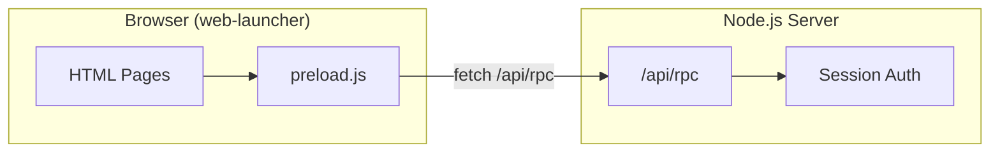
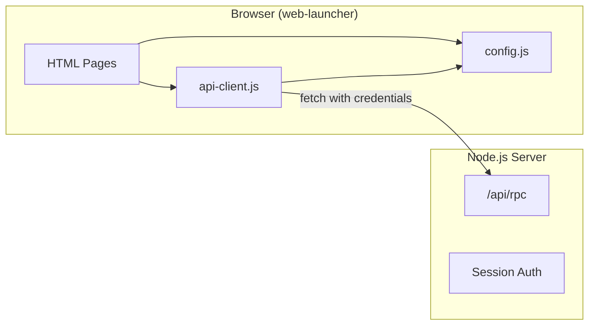
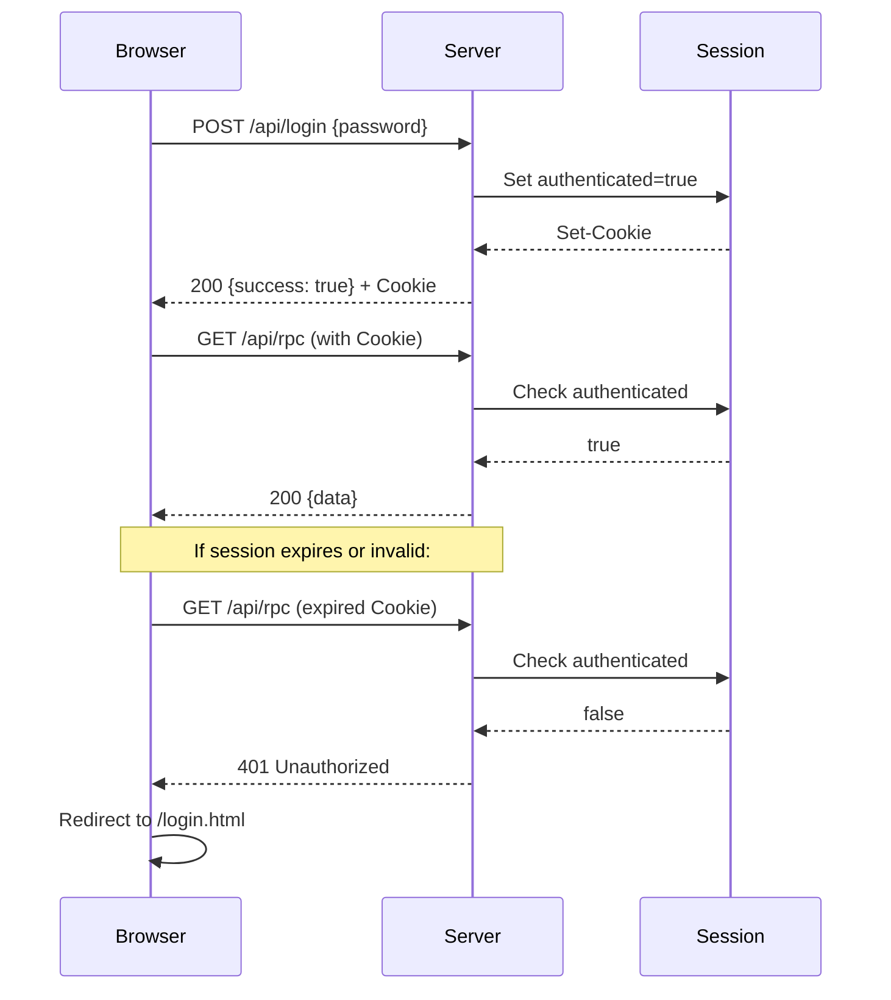
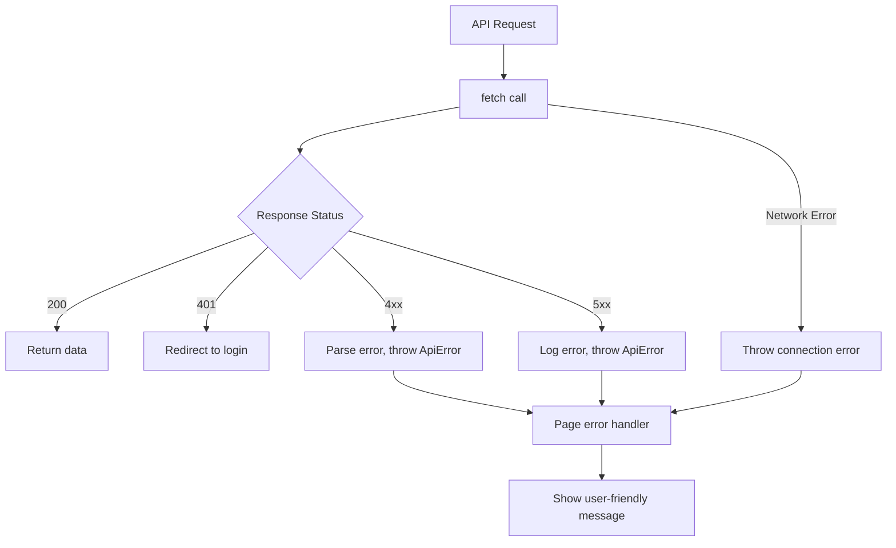

# Design: Issue #21 - Refactor Frontend to Remove Electron Dependency

## Overview
Remove the `window.electronAPI` abstraction and replace with `window.apiClient`, a modern API client that:
- Maintains backward compatibility with existing code
- Supports configurable API base URLs for future scalability
- Uses proper fetch patterns with credentials handling
- Provides consistent error handling across all pages

### Key Design Decisions

| Decision | Rationale | Trade-offs |
|----------|-----------|------------|
| Keep RPC pattern | Minimize backend changes; `/api/rpc` works well | Single endpoint vs REST; less discoverable |
| Proxy-based interface | Match current `electronAPI` interface exactly | Slightly more complex; easier migration |
| Global `window.apiClient` | Drop-in replacement for `window.electronAPI` | Could use ES modules; but requires build step |
| Config file injection | Simple HTML script tag; no build tooling | Less flexible than env vars at build time |

---

## Architecture

### Current State


### Target State


---

## Authentication Flow

### Current Authentication Mechanism
The application uses **session-based authentication** with cookies:

1. **Login**: `POST /api/login` with `{ password }` → Sets `req.session.authenticated = true`
2. **Session Cookie**: `express-session` sets a cookie (httpOnly, SameSite=lax or none for iframes)
3. **Auth Middleware**: All requests pass through `requireAuth` middleware
4. **401 Handling**: API requests get `401 JSON`, HTML requests redirect to `/login.html`



### API Client Authentication Handling

```javascript
// api-client.js - Authentication handling
async function callRpc(namespace, method, args) {
    const response = await fetch(`${AppConfig.API_BASE_URL}/rpc`, {
        method: 'POST',
        headers: { 'Content-Type': 'application/json' },
        credentials: 'include',  // CRITICAL: Include session cookies
        body: JSON.stringify({ namespace, method, args })
    });

    if (response.status === 401) {
        console.warn('[API] Session expired, redirecting to login');
        window.location.href = '/login.html';
        return; // Prevent further processing
    }

    if (!response.ok) {
        const error = await response.json();
        throw new ApiError(error.message, error.code, response.status);
    }

    return response.json();
}
```

---

## Error Handling Strategy

### Error Types

| Error Type | HTTP Status | User Action | Client Behavior |
|------------|-------------|-------------|-----------------|
| Unauthorized | 401 | Re-login required | Redirect to `/login.html` |
| Bad Request | 400 | Fix input | Show error message, keep on page |
| Not Found | 404 | Resource missing | Show appropriate message |
| Server Error | 500 | Retry or contact support | Show error, log details |
| Network Error | N/A | Check connection | Show "Connection error" message |

### Error Class

```javascript
// api-client.js
class ApiError extends Error {
    constructor(message, code, status) {
        super(message);
        this.name = 'ApiError';
        this.code = code;      // e.g., 'VALIDATION_ERROR'
        this.status = status;  // HTTP status
    }
}

window.ApiError = ApiError;  // Expose for page scripts
```

### Error Flow


---

## Component Specifications

### 1. config.js

**Location**: `web-launcher/public/js/config.js`

```javascript
/**
 * Application Configuration
 * 
 * API_BASE_URL: Base URL for API calls
 *   - Default: '/api' (same-origin)
 *   - Production: 'https://api.fleetillo.com/api' (when deployed separately)
 * 
 * To override: Set window.AppConfig before loading api-client.js
 */
window.AppConfig = window.AppConfig || {
    API_BASE_URL: '/api',
    DEBUG: false,
    VERSION: '1.0.0'
};
```

### 2. api-client.js

**Location**: `web-launcher/public/js/api-client.js`

**Interface Specification**:
```javascript
window.apiClient = {
    // Entity namespaces (all return Promises)
    bookings: {
        getAll(filters?, pagination?) → Promise<Booking[]>
        getById(id) → Promise<Booking>
        create(data) → Promise<Booking>
        update(data) → Promise<Booking>
        delete(id) → Promise<void>
        count(filters?) → Promise<number>
        removeFromRoute(id: string) → Promise<void>
    },
    
    customers: { /* same CRUD pattern */ },
    clients: { /* alias → customers */ },
    
    services: { /* same CRUD pattern */ },
    locations: { /* same CRUD pattern */ },
    vehicles: { /* same CRUD pattern */ },
    drivers: {
        // Standard CRUD
        getAll, getById, create, update, delete, count,
        // Driver-specific
        assignToVehicle(driverId, vehicleId) → Promise<void>
        unassignFromVehicle(driverId) → Promise<void>
        getVehicles(driverId) → Promise<Vehicle[]>
    },
    
    vehicleLocations: {
        getByVehicle(vehicleId) → Promise<Location[]>
        set(vehicleId, locationIds[]) → Promise<void>
        add(vehicleId, locationId) → Promise<void>
        remove(vehicleId, locationId) → Promise<void>
        setPrimary(vehicleId, locationId) → Promise<void>
    },
    
    routes: {
        // Standard CRUD
        getAll, getById, create, update, delete, count,
        // Route-specific
        plan(options) → Promise<Route>
        previewPlan(options) → Promise<RoutePlan>
        getNextAvailableDate(date) → Promise<string>
        getStatsByDateRange(start, end) → Promise<Stats>
    },
    
    geocoding: {
        autocomplete(query) → Promise<Prediction[]>
        geocodeAddress(address) → Promise<GeoResult>
    },
    
    activities: {
        getRecent(limit?) → Promise<Activity[]>
        getAll(filters?) → Promise<Activity[]>
        getByEntity(entityType, entityId) → Promise<Activity[]>
    },
    
    settings: {
        getAll() → Promise<Settings>
        getRouteSettings() → Promise<RouteSettings>
        update(key, value) → Promise<Setting>
        updateMultiple(settings[]) → Promise<void>
        getRoutePlanningParams() → Promise<Params>
    },
    
    dispatchJobs: {
        getAll(filters?, pagination?) → Promise<Job[]>
        getById(id) → Promise<Job>
        create(data) → Promise<Job>
        cancel(id) → Promise<void>
        execute(id) → Promise<void>
        removeDriver(jobId, driverId) → Promise<void>
        getDriversInActiveJobs() → Promise<Driver[]>
        checkDriverConflicts(driverIds) → Promise<Conflict[]>
        getPendingDue() → Promise<Job[]>
    },
    
    config: {
        getGoogleMapsApiKey() → Promise<string>
    }
};
```

---

## File-by-File Migration Analysis

### Files Using electronAPI

| File | Namespaces Used | API Calls | Migration Notes |
|------|-----------------|-----------|-----------------|
| `index.html` | customers, bookings, routes, vehicles, activities | count, getAll | Dashboard stats |
| `customers.html` | clients | getAll, create, update, delete | Full CRUD |
| `bookings.html` | bookings, clients, vehicles, routes, services | getAll, create, update, delete, count | Complex forms |
| `vehicles.html` | vehicles, locations, services, vehicleLocations | getAll, create, update, delete, getByVehicle, set | Multi-select locations |
| `drivers.html` | drivers, vehicles | getAll, create, update, delete, assignToVehicle | Avatar upload uses REST |
| `locations.html` | locations, clients, geocoding | getAll, create, update, delete, autocomplete, geocodeAddress | Google Maps integration |
| `routes.html` | routes, bookings, settings, config | getAll, plan, previewPlan, delete, getGoogleMapsApiKey | Complex planning |
| `services.html` | services | getAll, create, update, delete | Simple CRUD |
| `settings.html` | settings | getAll, getRouteSettings, updateMultiple | Multiple settings |
| `calendar.html` | bookings, routes, drivers | getAll, update | Calendar view |
| `dispatch.html` | dispatchJobs, drivers | getAll, create, execute, getDriversInActiveJobs | Real-time dispatch |

### Special Cases

1. **dispatch.html**: Also uses `dispatch-client.js` for direct dispatch service calls
2. **routes.html**: Uses `config.getGoogleMapsApiKey()` for Maps initialization
3. **drivers.html**: Avatar upload uses REST endpoint `/api/drivers/:id/avatar`, not RPC
4. **bookings.html**: CSV upload uses REST endpoint `/api/bookings/upload`

---

## Migration Strategy

### Phase 1: Create New Files
1. Create `public/js/config.js`
2. Create `public/js/api-client.js`
3. Test in isolation

### Phase 2: Migrate Pages (One at a Time)
For each HTML file:
1. Replace `<script src="preload.js">` with `<script src="js/config.js">` and `<script src="js/api-client.js">`
2. Find/replace `window.electronAPI` → `window.apiClient`
3. Test page functionality
4. Commit

**Order of migration** (simplest to complex):
1. services.html (simple CRUD)
2. customers.html (simple CRUD)
3. settings.html (simple CRUD)
4. vehicles.html (multi-select)
5. locations.html (geocoding)
6. drivers.html (avatar upload - REST separate)
7. bookings.html (complex forms)
8. calendar.html (calendar view)
9. index.html (dashboard)
10. routes.html (Maps, planning)
11. dispatch.html (real-time)

### Phase 3: Cleanup
1. Delete `preload.js`
2. Remove any backward compatibility code if not needed
3. Final testing

### Rollback Plan
- Keep `preload.js` until all pages migrated
- Each page can individually revert by changing script tags
- No feature flags needed for this change

---

## Testing Strategy

### Existing Tests
```bash
# Playwright web-launcher tests
npx playwright test --config=playwright.web-launcher.config.ts
```

### Manual Testing Checklist

| Page | Test Steps | Expected Result |
|------|------------|-----------------|
| Login | Enter password, submit | Redirected to dashboard |
| Dashboard | Load page | Stats display, no console errors |
| Customers | Add, edit, delete customer | Operations succeed |
| Vehicles | Add vehicle, assign locations | Locations persist |
| Drivers | Add driver, upload avatar | Driver created with avatar |
| Locations | Add location with geocoding | Address autocompletes, geocodes |
| Bookings | Create booking with services | Booking saved |
| Routes | Plan route with bookings | Route calculated, map displays |
| Settings | Change setting, reload | Setting persists |
| Dispatch | Create dispatch job | Job created, drivers notified |

### Console Error Check
After migration, verify NO console errors related to:
- `window.electronAPI is undefined`
- `TypeError: Cannot read property of undefined`
- CORS errors
- 401 errors (unless session expired)

---

## Security Considerations

| Concern | Mitigation |
|---------|------------|
| CSRF | Session cookies with `SameSite=lax` (or `none` for iframes with `Secure`) |
| XSS | No user input directly in RPC calls; server validates all input |
| Credential exposure | `credentials: 'include'` only sends cookies, no tokens in JS |
| API key exposure | Google Maps API key fetched via RPC, not hardcoded |

---

## Design Decisions (Resolved)

| Question | Decision | Rationale |
|----------|----------|-----------|
| **dispatch-client.js** | Keep separate | Already has its own API layer for dispatch service |
| **Shared folder** | Exclude from scope | Used by electron-launcher; will address in follow-up issue #27 |
| **Build tooling** | Script tags (bundle-ready) | Keep simple; structure code for easy future migration to ES modules (follow-up issue #28) |

## Out of Scope

The following items are explicitly excluded and tracked in separate issues:

1. **Issue #27**: Consolidate `/shared/public/` and `/web-launcher/public/` folders
2. **Issue #28**: Introduce bundler (Vite/Webpack) for frontend assets

