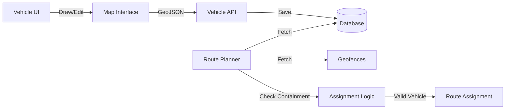

# Design: Issue #3 - Vehicle Geofencing

## Overview

Implement vehicle geofencing by adding a `geofence` column to the `vehicles` table and updating the route assignment logic to enforce these spatial constraints. A map-based UI will allow users to draw/edit these geofences.

### Key Design Decisions

1. **GeoJSON Storage**: Store geofences as GeoJSON objects in a JSONB column for flexibility and standard compatibility.
2. **Turf.js for Frontend**: Use Turf.js for frontend map drawing and validation logic.
3. **Turf.js/PostGIS for Backend**: Use Turf.js (if Node) or PostGIS (if available) for containment checks. Given the existing Node stack, Turf.js is a safe default for logic.

## Architecture



## Database Schema

```sql
-- Migration: Add geofence to vehicles
ALTER TABLE optiroute.vehicles 
ADD COLUMN geofence JSONB DEFAULT NULL;

-- Example Data
-- { "type": "Polygon", "coordinates": [[[lng,lat], ...]] }
```

## Logic: Containment Check

```typescript
import * as turf from '@turf/turf';

function isRouteAllowedForVehicle(route: Route, vehicle: Vehicle): boolean {
  if (!vehicle.geofence) return true; // Unrestricted

  const poly = turf.polygon(vehicle.geofence.coordinates);
  
  for (const stop of route.stops) {
    const point = turf.point([stop.lng, stop.lat]);
    if (!turf.booleanPointInPolygon(point, poly)) {
      return false; // Stop outside geofence
    }
  }
  return true;
}
```

## UI Components

### Vehicle Map Editor
- **Library**: Leaflet or Mapbox GL JS (matching existing project choice)
- **Draw Plugin**: Leaflet-Draw or Mapbox Draw
- **Interaction**:
  - "Set Geofence" button opens map modal
  - User draws polygon
  - "Save" updates hidden input with GeoJSON string

### Route Visualization
- Overlay vehicle polygons on the route map
- Color code compatible vs incompatible zones

## API Updates

1. **GET /vehicles**: Include `geofence` field
2. **POST/PUT /vehicles**: Accept `geofence` JSON
3. **RPC routes.plan**: Update algorithm to filter candidates using containment check

## File Changes

| File | Change |
|------|--------|
| `supabase/migrations/...` | Add column migration |
| `web-launcher/public/vehicles.html` | Add map drawing UI |
| `src/services/route.service.ts` | Add containment validation |
| `src/types.ts` | Update Vehicle interface |

## Error Handling

- **Invalid Polygon**: Validate geometry before save (closed ring, 3+ points)
- **Self-intersection**: Prevent self-intersecting polygons in UI
