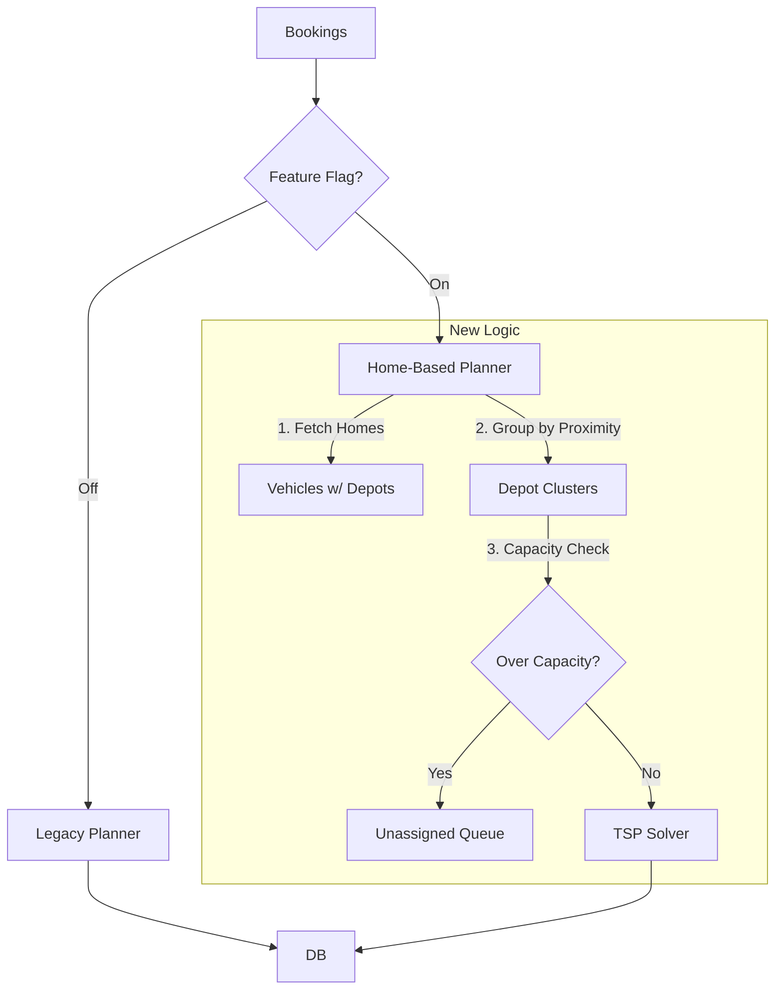
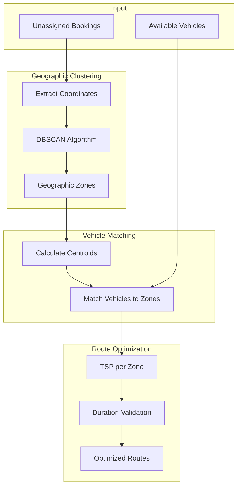

# Design: Issue #46 - Route Planning City Clustering Bug

## Overview

Implement geographic clustering in the route generation algorithm to prevent distant locations from being assigned to the same route.

### Migration Strategy: Phased Rollout

To mitigate risk, we will use a Feature Flag pattern.

1.  **Shadow Mode**:
    - Trigger both Old and New planners.
    - Save Old Result -> `routes` table (Production).
    - Save New Result -> `shadow_routes` table (Analysis).
    - Compare metrics (total distance, unassigned count).

2.  **Feature Flag**:
    - `shouldUseClustering(region_id)` logic in the Dispatch Service.
    - We can enable the new logic for a single low-risk region first.

## Architecture



(Detailed internal flow below)



## Components and Interfaces

### Clustering Service

```typescript
interface ClusteringConfig {
  maxDistanceMiles: number;  // 50 default
  minClusterSize: number;    // 2 minimum
}

interface GeographicCluster {
  id: string;
  bookings: Booking[];
  centroid: { lat: number; lng: number };
  boundingBox: BoundingBox;
}

function clusterBookings(
  bookings: Booking[],
  config: ClusteringConfig
): GeographicCluster[];
```

### Vehicle Matching

```typescript
interface VehicleMatch {
  cluster: GeographicCluster;
  vehicle: Vehicle;
  distanceFromHome: number;
}

function matchVehiclesToClusters(
  clusters: GeographicCluster[],
  vehicles: Vehicle[]
): VehicleMatch[];
```

### Route Optimization

```typescript
interface OptimizedRoute {
  vehicle: Vehicle;
  stops: RouteStop[];
  totalDistanceMiles: number;
  estimatedDurationMinutes: number;
  feasible: boolean;
  warnings: string[];
}

function optimizeRoute(
  cluster: GeographicCluster,
  vehicle: Vehicle
): OptimizedRoute;
```

## Algorithm: Home-Based Assignment

```
Input: Unassigned Bookings, Available Vehicles (w/ Home Locations)
Output: Routes per Vehicle, Unassigned List

1. Identify Clusters (Centers):
   - Get unique Home Locations/Depots derived from active Vehicles.

2. Assign Bookings to Home Clusters:
   - For each booking:
     - Find nearest Home Location (linear distance).
     - If distance > MaxRadius (e.g. 50mi) -> Flag "Out of Area".
     - Else -> Add to Cluster[HomeID].

3. Capacity Check & Routing (Per Cluster):
   - AvailableVehicles = Vehicles with homeLocationId == Cluster.ID
   - Solvable? 
     - If Bookings > (Vehicles * MaxStops):
       - Prioritize bookings (e.g. by time window or proximity).
       - Move excess to "Unassigned (Capacity Overflow)".
   - Solve TSP for remaining bookings using assignments.
```

## Data Flow

```mermaid
sequenceDiagram
    participant UI as Route Preview
    participant API as Route API
    participant Cluster as Clustering
    participant Match as Vehicle Match
    participant Opt as Optimizer
    
    UI->>API: Plan routes for date
    API->>Cluster: Get bookings, cluster
    Cluster-->>API: Geographic zones
    API->>Match: Match vehicles
    Match-->>API: Vehicle assignments
    loop Per cluster
        API->>Opt: Optimize route
        Opt-->>API: Optimized stops
    end
    API-->>UI: Route preview
```

## File Changes

| File | Change |
|------|--------|
| `src/services/route.service.ts` | Add clustering before optimization |
| `src/services/clustering.service.ts` | New service for DBSCAN |
| `src/services/distance.service.ts` | Distance matrix integration |
| `web-launcher/public/routes.html` | Show distance warnings |

## Error Handling & Safety Nets

| Scenario | Handling |
|----------|----------|
| No nearby bookings | Create single-stop route OR flag as "Needs Manual Assignment" |
| No available vehicles | **CRITICAL**: Move booking to "Unassigned Queue". Do NOT fail entire batch. |
| Route exceeds shift | Split into multiple routes. If vehicle exhausted -> "Unassigned Queue" |
| Distance API down | Fall back to haversine × 1.4. Log warning. |
| Geocoding Failure | Flag booking as "Invalid Address". Alert User. |
| **System Crash** | Transaction roll-back. No partial/corrupt routes saved. |

## Unassigned Booking Workflow

1.  **Optimization Result**: The planner returns `{ routes: [...], unassigned: [{ bookingId, reason }] }`.
2.  **Persistence**:
    *   Saved Routes are committed to DB.
    *   Unassigned bookings are updated with a status `planning_failed` and a `metadata.planning_error` field.
3.  **UI Alert**:
    *   Dashboard/Route View highlights `planning_failed` bookings in red.
    *   "Retry" action available for individual unassigned bookings.
