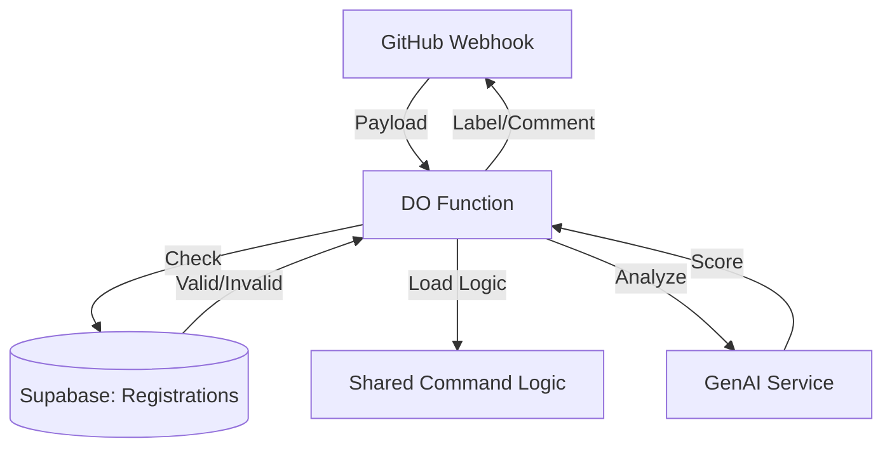
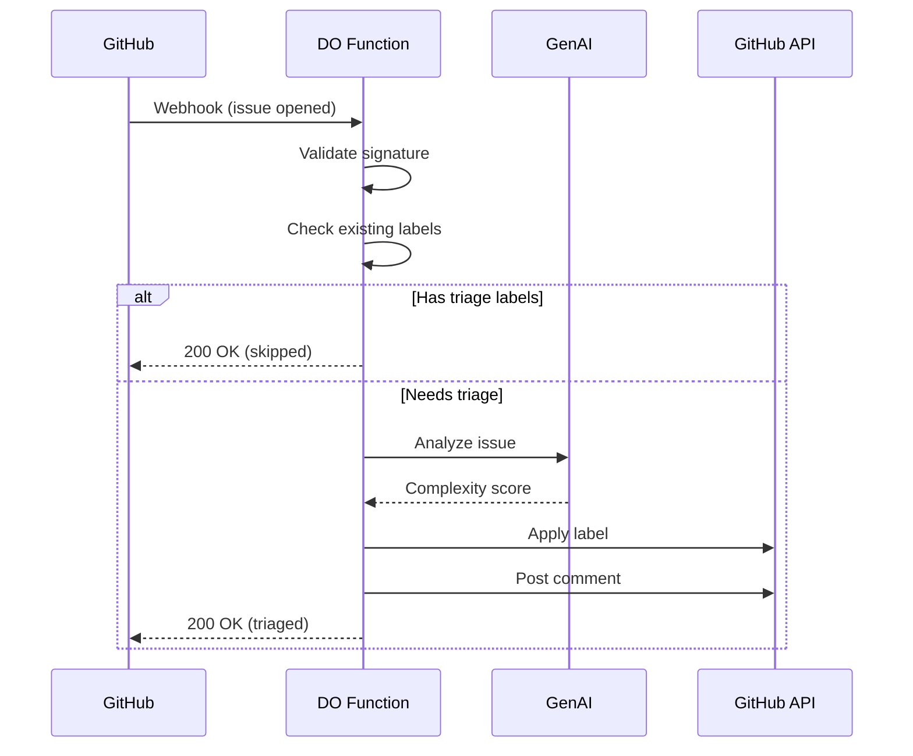

# Design: Issue #47 - Automated Issue Triage via DigitalOcean Function

## Overview

A DigitalOcean Function receives GitHub webhook events and automatically applies complexity labels to new issues using AI-powered analysis.

## Architecture: Multi-Tenant Triage System

The function serves as a central hub for multiple repositories. It validates incoming webhooks against a registry in Supabase before processing.



### Repo Registration Schema

We will use Supabase to track authorized repositories.

```sql
create table public.repo_registrations (
  id uuid primary key default gen_random_uuid(),
  full_name text not null unique, -- e.g. "org/repo"
  is_active boolean default true,
  created_at timestamptz default now(),
  config jsonb default '{}' -- Optional overrides
);
```

### Shared Logic Implementation
The automation logic (prompts/rules) is imported from the shared `agent-commands` package/submodule. This ensures that *any* registered repo is triaged using the standardized "Company Standard" logic.

## Components and Interfaces

### Request Flow



## Components and Interfaces

### Function Configuration

```typescript
// packages/functions/triage-issue/index.ts
interface FunctionConfig {
  GITHUB_TOKEN: string;
  WEBHOOK_SECRET: string;
  DO_GENAI_KEY?: string;
}
```

### Webhook Payload

```typescript
interface IssueWebhookPayload {
  action: 'opened' | 'reopened' | 'edited';
  issue: {
    number: number;
    title: string;
    body: string;
    labels: Array<{ name: string }>;
  };
  repository: {
    full_name: string;
  };
}
```

### Triage Response

```typescript
interface TriageResult {
  issue: number;
  action: 'triaged' | 'skipped';
  tier?: 'simple' | 'medium' | 'complex';
  score?: number;
  reason?: string;
}
```

## File Structure

```
do-functions/
└── packages/
    └── triage-issue/
        ├── index.ts           # Main handler
        ├── webhook.ts         # Signature validation
        ├── analyzer.ts        # AI analysis
        ├── github.ts          # GitHub API client
        └── scoring.ts         # Complexity scoring logic
```

## AI Analysis Prompt

```
Analyze this GitHub issue for implementation complexity.

Title: {title}
Body: {body}

Score each factor 0-2:
- Files affected: 0=1-2, 1=3-5, 2=6+
- Architecture: 0=none, 1=minor, 2=major
- Database: 0=none, 1=column, 2=tables
- API changes: 0=none, 1=modify, 2=new
- External integration: 0=none, 1=existing, 2=new
- Security: 0=none, 1=validation, 2=auth
- Requirements clarity: 0=clear, 1=flexible, 2=vague

Return JSON: { "scores": {...}, "total": N, "reasoning": "..." }
```

## Error Handling

| Error | Action |
|-------|--------|
| Invalid signature | Return 401, log attempt |
| AI service down | Skip labeling, log error, return 500 |
| GitHub API error | Retry once, log failure, return 500 |
| Rate limit | Return 429, include retry-after |

## Environment Variables

| Variable | Description |
|----------|-------------|
| GITHUB_TOKEN | PAT with `issues:write` scope |
| WEBHOOK_SECRET | Shared secret for signature validation |
| DO_GENAI_KEY | DigitalOcean GenAI access key |
