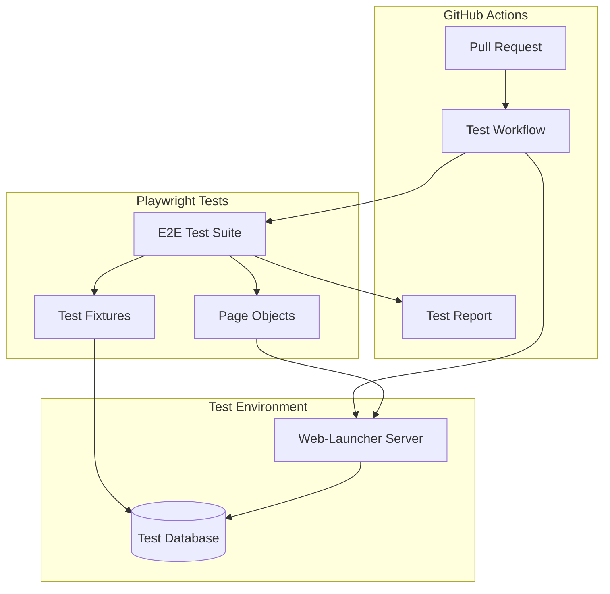
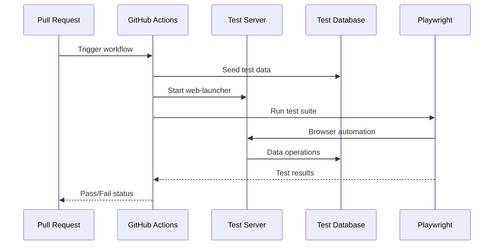

# Design: Issue #68 - Implement Robust Regression Testing

## Overview

This document outlines the technical architecture for implementing E2E regression testing using Playwright, integrated with GitHub Actions CI/CD pipeline. The design prioritizes fast feedback, reliable test execution, and maintainable test code.

### Key Design Decisions

1. **Playwright over Cypress**: Playwright supports multiple browsers, has better TypeScript support, and is recommended in the project's testing guidelines
2. **Server-side test execution**: Tests run against a dedicated test server, not production
3. **Fixture-based test data**: Use Playwright fixtures for test data seeding and cleanup
4. **Page Object Model**: Abstract page interactions for maintainability

## Architecture



### Test Execution Flow



## Components and Interfaces

### Test Configuration

```typescript
// playwright.config.ts
interface PlaywrightConfig {
  testDir: string;           // './tests/e2e'
  timeout: number;           // 30000ms per test
  retries: number;           // 2 retries for flaky tests
  workers: number;           // 4 parallel workers
  use: {
    baseURL: string;         // 'http://localhost:3000'
    screenshot: 'only-on-failure';
    video: 'retain-on-failure';
    trace: 'retain-on-failure';
  };
}
```

### Page Object Model

```typescript
// tests/e2e/pages/base.page.ts
interface BasePage {
  goto(): Promise<void>;
  waitForLoad(): Promise<void>;
}

// tests/e2e/pages/locations.page.ts
interface LocationsPage extends BasePage {
  openEditModal(locationName: string): Promise<void>;
  verifyCustomerName(expected: string): Promise<void>;
  saveLocation(): Promise<void>;
  createLocation(data: LocationData): Promise<void>;
}

// tests/e2e/pages/customers.page.ts
interface CustomersPage extends BasePage {
  createCustomer(data: CustomerData): Promise<void>;
  deleteCustomer(name: string): Promise<void>;
  verifyCustomerInList(name: string): Promise<boolean>;
}
```

### Test Fixtures

```typescript
// tests/e2e/fixtures/test-data.fixture.ts
interface TestDataFixture {
  customer: Customer;
  location: Location;
  driver: Driver;
  vehicle: Vehicle;
}

// Fixture provides seeded test data to each test
const test = base.extend<TestDataFixture>({
  customer: async ({ }, use) => {
    const customer = await seedCustomer();
    await use(customer);
    await cleanupCustomer(customer.id);
  }
});
```

## File Structure

```
tests/
├── e2e/
│   ├── fixtures/
│   │   ├── test-data.fixture.ts
│   │   └── auth.fixture.ts
│   ├── pages/
│   │   ├── base.page.ts
│   │   ├── customers.page.ts
│   │   ├── locations.page.ts
│   │   ├── calendar.page.ts
│   │   └── dispatch.page.ts
│   ├── specs/
│   │   ├── customers.spec.ts
│   │   ├── locations.spec.ts
│   │   ├── calendar.spec.ts
│   │   └── regression/
│   │       └── issue-57-customer-terminology.spec.ts
│   └── utils/
│       ├── database.ts
│       └── api.ts
├── playwright.config.ts
└── package.json (test dependencies)
```

## GitHub Actions Integration

```yaml
# .github/workflows/e2e-tests.yml
name: E2E Tests
on: [pull_request]
jobs:
  test:
    runs-on: ubuntu-latest
    services:
      postgres:
        image: postgres:15
        env:
          POSTGRES_DB: fleetillo_test
    steps:
      - uses: actions/checkout@v4
      - uses: actions/setup-node@v4
      - run: npm ci
      - run: npx playwright install
      - run: npm run db:seed:test
      - run: npm run dev &
      - run: npx playwright test
      - uses: actions/upload-artifact@v4
        if: failure()
        with:
          name: test-results
          path: test-results/
```

## Data Models

### Test Database Schema

Uses same schema as production but with isolated test database:

```sql
-- Test data seeding script
-- Creates minimal reproducible dataset

INSERT INTO customers (id, name, email) VALUES 
  ('test-customer-1', 'Test Customer', 'test@example.com');

INSERT INTO locations (id, name, customer_id) VALUES
  ('test-location-1', 'Test Location', 'test-customer-1');
```

## Error Handling

| Error Type | Handling |
|------------|----------|
| Test timeout | Retry up to 2 times, then fail with screenshot |
| Element not found | Clear error message with selector info |
| Network error | Retry with exponential backoff |
| Database connection | Fail fast with clear error message |

## Testing Strategy

### Unit Tests (Existing)
- Jest for service/utility functions
- Fast, no browser needed

### E2E Tests (New)
- Playwright for full user flows
- Covers critical paths and regression areas

### Visual Tests (Phase 2)
- Playwright screenshots
- Baseline comparison on PR

## Performance Targets

| Metric | Target |
|--------|--------|
| Full test suite | < 10 minutes |
| Individual test | < 30 seconds |
| CI feedback | < 15 minutes total |
| Parallel workers | 4 |
