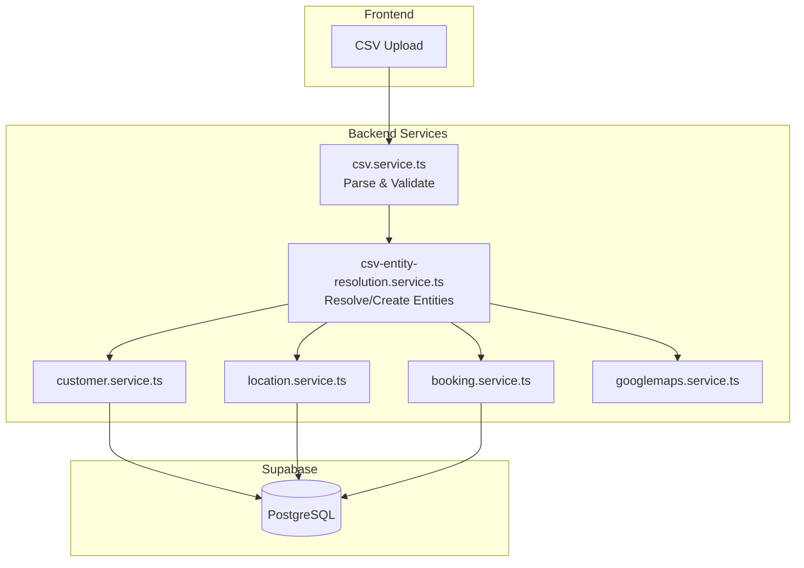
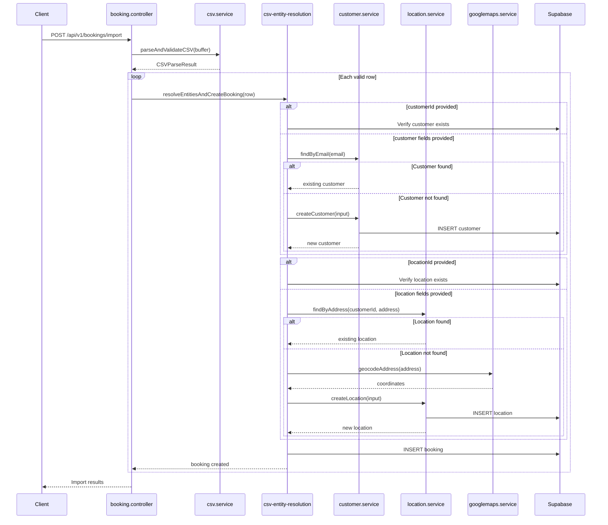

# Design: Issue #74 - Enable Customer and Location Creation via Booking CSV Import

## Overview

This design extends the existing CSV import workflow to support creating new customers and locations on-the-fly. The implementation follows the existing service architecture, adding a new entity resolution layer between CSV parsing and booking creation.

### Key Design Decisions

1. **Resolution Service Pattern**: Introduce a new `csv-entity-resolution.service.ts` that handles customer and location lookup/creation, keeping the CSV service focused on parsing and validation.

2. **Database Transactions**: Use Supabase's transaction support (via RPC) for atomic row processing, ensuring customer + location + booking are created together or not at all.

3. **Async Geocoding**: Geocode new locations asynchronously during creation, but don't block on failures. Missing coordinates can be backfilled later.

4. **Backward Compatibility**: All new CSV columns are optional. Existing CSV files with UUID-only columns continue to work unchanged.

## Architecture



### Request Flow



## Components and Interfaces

### CSV Entity Resolution Service (NEW)

**File:** `src/services/csv-entity-resolution.service.ts`

This new service handles the business logic of resolving or creating customers and locations from CSV row data.

```typescript
interface CSVEntityResolutionResult {
  customerId: string;
  locationId?: string;
  customerCreated: boolean;
  locationCreated: boolean;
}

interface ResolveCustomerInput {
  customerId?: string;
  customerName?: string;
  customerEmail?: string;
  customerPhone?: string;
}

interface ResolveLocationInput {
  customerId: string;
  locationId?: string;
  locationName?: string;
  locationAddressLine1?: string;
  locationAddressLine2?: string;
  locationCity?: string;
  locationState?: string;
  locationPostalCode?: string;
  locationCountry?: string;
}

// Main resolution function
async function resolveEntities(
  customerInput: ResolveCustomerInput,
  locationInput: ResolveLocationInput
): Promise<Result<CSVEntityResolutionResult>>;

// Customer resolution
async function resolveCustomer(
  input: ResolveCustomerInput
): Promise<Result<{ customerId: string; created: boolean }>>;

// Location resolution
async function resolveLocation(
  input: ResolveLocationInput
): Promise<Result<{ locationId: string; created: boolean }>>;
```

### Extended CSV Row Interface

**File:** `src/services/csv.service.ts` (MODIFIED)

```typescript
export interface CSVBookingRow {
  // Existing required fields
  customerId?: string;  // Now optional when customer fields provided
  bookingType: string;
  scheduledDate: string;

  // NEW: Customer creation fields
  customerName?: string;
  customerEmail?: string;
  customerPhone?: string;

  // Existing optional location field
  locationId?: string;

  // NEW: Location creation fields
  locationName?: string;
  locationAddressLine1?: string;
  locationAddressLine2?: string;
  locationCity?: string;
  locationState?: string;
  locationPostalCode?: string;
  locationCountry?: string;

  // ... existing optional fields unchanged
}
```

### Customer Service Extension

**File:** `src/services/customer.service.ts` (MODIFIED)

Add new lookup methods:

```typescript
// Find customer by email (case-insensitive)
async function findCustomerByEmail(
  email: string
): Promise<Result<Customer | null>>;

// Find customers by name (case-insensitive)
async function findCustomersByName(
  name: string
): Promise<Result<Customer[]>>;
```

### Location Service Extension

**File:** `src/services/location.service.ts` (MODIFIED)

Add duplicate detection method:

```typescript
// Find existing location by address for a customer
async function findLocationByAddress(
  customerId: string,
  addressLine1: string,
  city: string,
  state: string,
  postalCode: string
): Promise<Result<Location | null>>;
```

## Data Models

### No Schema Changes Required

The existing database schema supports all required fields:

- **customers table**: Already has `name`, `email`, `phone` columns
- **locations table**: Already has all address fields and `customer_id` foreign key
- **bookings table**: Already has `customer_id` and `location_id` foreign keys

### TypeScript Types

No new database types required. Extended interfaces for CSV processing are internal to the service layer.

## API Design

### POST /api/v1/bookings/import

No API changes required. The endpoint already accepts CSV file uploads and returns import results.

**Extended Response** (internal changes only):

```json
{
  "success": true,
  "data": {
    "totalRows": 100,
    "validRows": 95,
    "invalidRows": 5,
    "customersCreated": 12,
    "locationsCreated": 18,
    "errors": [
      {
        "row": 23,
        "message": "Multiple customers found with name 'John Smith'. Please provide customerEmail to disambiguate."
      }
    ]
  }
}
```

## Error Handling

| Error Code | HTTP Status | Description |
|------------|-------------|-------------|
| CUSTOMER_AMBIGUOUS | 400 | Multiple customers match name, email required |
| CUSTOMER_CREATE_FAILED | 500 | Failed to create new customer |
| LOCATION_CREATE_FAILED | 500 | Failed to create new location |
| LOCATION_INCOMPLETE | 400 | Missing required location fields |
| GEOCODING_FAILED | 200 (warning) | Address geocoding failed, location created without coordinates |

### Error Messages

```typescript
const ErrorMessages = {
  CUSTOMER_AMBIGUOUS: (name: string, count: number) =>
    `Multiple customers (${count}) found with name '${name}'. Please provide customerEmail to disambiguate.`,

  CUSTOMER_REQUIRED:
    'Either customerId or customerName is required',

  LOCATION_INCOMPLETE: (missing: string[]) =>
    `Location creation requires: ${missing.join(', ')}`,

  GEOCODING_WARNING: (address: string) =>
    `Warning: Could not geocode address '${address}'. Location created without coordinates.`,
};
```

## Testing Strategy

### Unit Tests

**File:** `tests/unit/services/csv-entity-resolution.service.test.ts`

1. **Customer Resolution Tests**
   - Returns existing customer when customerId provided
   - Finds customer by email (case-insensitive)
   - Finds customer by exact name when unique
   - Returns error when multiple name matches
   - Creates new customer when not found
   - Uses provided customerId over creation fields

2. **Location Resolution Tests**
   - Returns existing location when locationId provided
   - Finds existing location by address match
   - Creates new location when not found
   - Associates location with customer
   - Sets is_primary=true for first location
   - Handles geocoding success/failure

3. **Integration Tests**
   - Full row processing with customer + location + booking creation
   - Rollback on failure
   - Backward compatibility with UUID-only rows

### E2E Tests

**File:** `tests/e2e/booking-csv-import.e2e.spec.ts`

1. Import CSV with existing UUIDs (backward compatibility)
2. Import CSV creating new customers
3. Import CSV creating new locations
4. Import CSV with mixed existing/new entities
5. Error handling for ambiguous customer names
6. Verify geocoding populates coordinates

## Risks and Mitigations

| Risk | Impact | Probability | Mitigation |
|------|--------|-------------|------------|
| Duplicate customers created on concurrent imports | Medium | Low | Use email as unique key in DB, handle unique constraint errors |
| Geocoding rate limits exceeded | Low | Medium | Batch geocoding with rate limiting, async processing |
| Large CSV import timeout | Medium | Medium | Process in batches, consider background job for large imports |
| Customer name matching too loose | Medium | Medium | Require email for disambiguation, case-insensitive exact match |

## Implementation Notes

### Geocoding Strategy

1. Attempt geocoding synchronously during location creation
2. If geocoding fails, create location without coordinates
3. Log warning in response for failed geocodes
4. Existing backfill script can populate missing coordinates later

### Transaction Handling

```typescript
// Pseudo-code for row processing
async function processRow(row: CSVBookingRow): Promise<Result<Booking>> {
  // Note: Supabase doesn't support client-side transactions
  // Use database function for atomic operations, or handle rollback manually

  try {
    // 1. Resolve/create customer
    const customerResult = await resolveCustomer(row);
    if (!customerResult.success) return customerResult;

    // 2. Resolve/create location
    const locationResult = await resolveLocation({
      customerId: customerResult.data.customerId,
      ...row
    });
    if (!locationResult.success) {
      // Rollback: delete customer if we just created it
      if (customerResult.data.created) {
        await deleteCustomer(customerResult.data.customerId);
      }
      return locationResult;
    }

    // 3. Create booking
    const bookingResult = await createBooking({
      customerId: customerResult.data.customerId,
      locationId: locationResult.data?.locationId,
      ...row
    });
    if (!bookingResult.success) {
      // Rollback: delete location and customer if we just created them
      // ... rollback logic
      return bookingResult;
    }

    return bookingResult;
  } catch (error) {
    // Handle unexpected errors with full rollback
  }
}
```

### Performance Considerations

1. **Batch geocoding**: Use `batchGeocodeAddresses()` for large imports
2. **Customer lookup cache**: Cache customer lookups within a single import to avoid repeated queries
3. **Parallel processing**: Process independent rows in parallel (with concurrency limit)
