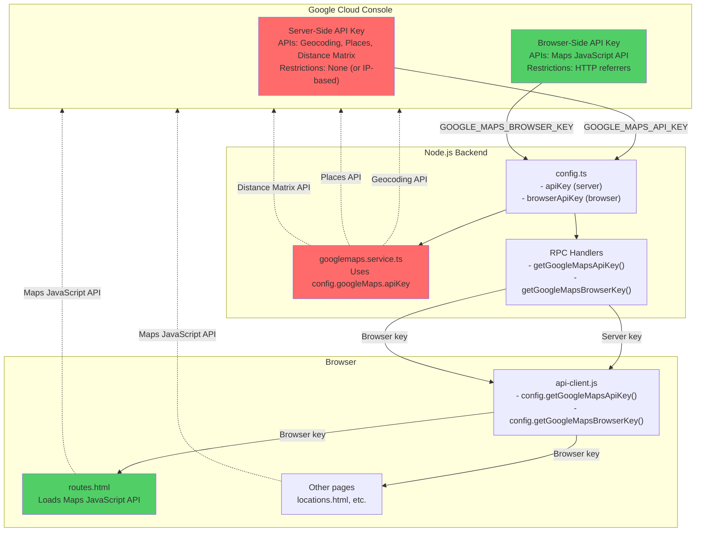
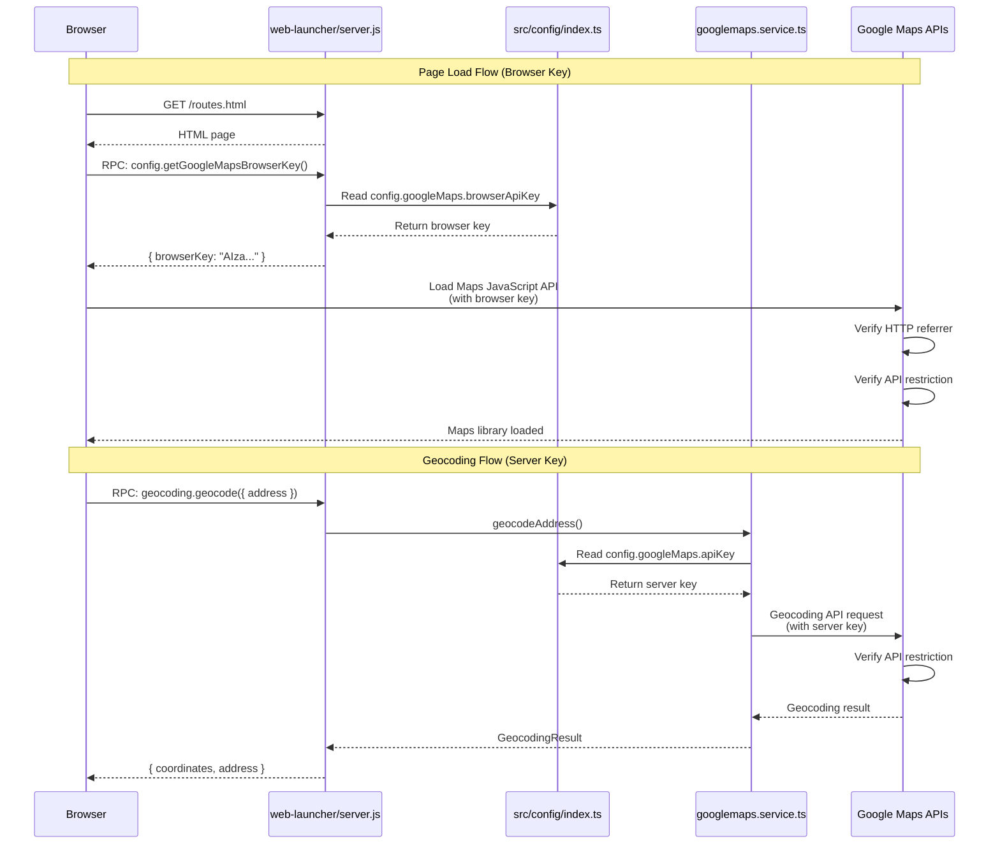

# Design: Issue #76 - Implement two-key Google Maps API configuration for server and browser

## Overview

This design implements a two-key Google Maps API architecture that separates server-side and browser-side API access for enhanced security. The implementation maintains backward compatibility while providing a smooth migration path from the current single-key configuration.

The core principle is **principle of least privilege**: each key has only the permissions it absolutely needs, and the server-side key is never exposed to browsers where it could be stolen.

### Key Design Decisions

1. **Fallback mechanism for backward compatibility**
   - **Rationale**: Allows zero-downtime deployment. Code can be deployed before environment variables are updated. If `GOOGLE_MAPS_BROWSER_KEY` is missing, the system falls back to `GOOGLE_MAPS_API_KEY`.
   - **Trade-offs**: Slightly more complex code logic, but eliminates deployment risk and allows gradual rollout.

2. **Separate RPC endpoints for server and browser keys**
   - **Rationale**: Clear separation of concerns. Frontend explicitly requests browser key via `getGoogleMapsBrowserKey()`. Existing `getGoogleMapsApiKey()` remains for legacy compatibility.
   - **Trade-offs**: Two endpoints instead of one, but improves clarity and prevents accidental exposure of server key.

3. **No authentication required for browser key endpoint**
   - **Rationale**: The browser key is designed to be public. Its security comes from HTTP referrer restrictions and API restrictions, not from hiding it.
   - **Trade-offs**: Key is visible to anyone, but that's by design—it can't be abused due to restrictions.

4. **Update all HTML pages that use Google Maps**
   - **Rationale**: Ensures consistent usage of browser-side key across the application. Prevents accidental use of server-side key in browser contexts.
   - **Trade-offs**: More files to update, but ensures complete security separation.

## Architecture



### Request Flow



## Components and Interfaces

### Configuration (src/config/index.ts)

Updated TypeScript interface and configuration loading:

```typescript
// src/config/index.ts

/**
 * Google Maps API configuration
 * Supports two-key architecture for enhanced security
 */
export interface GoogleMapsConfig {
  apiKey?: string;         // Server-side key (existing)
  browserApiKey?: string;  // Browser-side key (NEW)
}

function createConfig(): AppConfig {
  return {
    // ... existing config ...
    googleMaps: {
      apiKey: process.env.GOOGLE_MAPS_API_KEY,
      browserApiKey: process.env.GOOGLE_MAPS_BROWSER_KEY, // NEW
    },
    // ... rest of config ...
  };
}

// Validation and logging
export function validateGoogleMapsConfig(): {
  isValid: boolean;
  mode: 'two-key' | 'single-key' | 'missing';
  warnings: string[];
} {
  const { apiKey, browserApiKey } = config.googleMaps;
  const warnings: string[] = [];

  if (!apiKey && !browserApiKey) {
    return {
      isValid: false,
      mode: 'missing',
      warnings: ['No Google Maps API keys configured']
    };
  }

  if (apiKey && browserApiKey) {
    console.log('[Config] Google Maps: Two-key mode active ✓');
    return {
      isValid: true,
      mode: 'two-key',
      warnings: []
    };
  }

  if (apiKey && !browserApiKey) {
    const warning = 'Google Maps: Single-key mode (legacy). Consider migrating to two-key architecture for enhanced security.';
    console.warn(`[Config] ${warning}`);
    warnings.push(warning);
    return {
      isValid: true,
      mode: 'single-key',
      warnings
    };
  }

  // browserApiKey without apiKey
  warnings.push('Browser key configured but no server key. This is unusual.');
  return {
    isValid: false,
    mode: 'single-key',
    warnings
  };
}
```

### RPC Handlers (Backend)

The backend needs to expose both keys via RPC endpoints. Location depends on where RPC handlers are currently implemented.

```typescript
// Likely in: web-launcher/server.js or src/routes/rpc.ts

/**
 * Config RPC handlers
 */
const configHandlers = {
  /**
   * Get Google Maps API key (server-side)
   * Legacy endpoint for backward compatibility
   */
  getGoogleMapsApiKey: () => {
    return config.googleMaps.apiKey || '';
  },

  /**
   * Get Google Maps browser API key (NEW)
   * Returns browser-specific key, falls back to server key if not configured
   */
  getGoogleMapsBrowserKey: () => {
    const { apiKey, browserApiKey } = config.googleMaps;

    if (browserApiKey) {
      return browserApiKey;
    }

    // Fallback to server key for backward compatibility
    if (apiKey) {
      console.warn('[Config] GOOGLE_MAPS_BROWSER_KEY not configured, falling back to GOOGLE_MAPS_API_KEY. This is not recommended for security.');
      return apiKey;
    }

    console.error('[Config] No Google Maps API keys configured');
    return '';
  }
};

// Register handlers with RPC router
rpcRouter.register('config', configHandlers);
```

### API Client (Frontend)

Update the API client to expose the new browser key endpoint:

```typescript
// web-launcher/public/js/api-client.js

window.apiClient = {
  // ... existing namespaces ...

  config: {
    // Existing: Returns server-side key
    getGoogleMapsApiKey: () => ApiClient.callRpc('config', 'getGoogleMapsApiKey', []),

    // NEW: Returns browser-side key
    getGoogleMapsBrowserKey: () => ApiClient.callRpc('config', 'getGoogleMapsBrowserKey', [])
  }
};
```

### Frontend Google Maps Loading

Update all HTML pages that load Google Maps to use the browser-side key:

```javascript
// web-launcher/public/routes.html (and other pages)

async function loadGoogleMaps() {
    if (googleMapsLoaded) return;

    // NEW: Use browser-specific key
    let apiKey = await window.apiClient.config.getGoogleMapsBrowserKey();

    // Fallback for development/testing
    if (!apiKey) {
        console.warn('[Maps] Browser API key not available, trying server key (NOT RECOMMENDED)');
        apiKey = await window.apiClient.config.getGoogleMapsApiKey();
    }

    if (!apiKey) {
        console.error('[Maps] Google Maps API key not found');
        return;
    }

    return new Promise((resolve, reject) => {
        const script = document.createElement('script');
        script.src = `https://maps.googleapis.com/maps/api/js?key=${apiKey}&libraries=geometry`;
        script.async = true;
        script.defer = true;
        script.onload = () => {
            googleMapsLoaded = true;
            console.log('[Maps] Google Maps JavaScript API loaded successfully');
            resolve();
        };
        script.onerror = (error) => {
            console.error('[Maps] Failed to load Google Maps JavaScript API:', error);
            reject(error);
        };
        document.head.appendChild(script);
    });
}
```

## Data Models

### Environment Variables

```bash
# .env (local development)

# Google Maps API Keys - Two-Key Architecture
# Server-side key: Used by Node.js backend for Geocoding, Places, Distance Matrix APIs
GOOGLE_MAPS_API_KEY=AIzaXXXXXXXXXXXXXXXXXXXXXXXXXXXXXXX

# Browser-side key: Used by frontend for Maps JavaScript API (with HTTP referrer restrictions)
GOOGLE_MAPS_BROWSER_KEY=AIzaYYYYYYYYYYYYYYYYYYYYYYYYYYYYYYY
```

### DigitalOcean App Spec

```yaml
# deploy/do-app-spec.embedded.yaml

envs:
  # ... existing environment variables ...

  # Google Maps - Server-Side API Key
  - key: GOOGLE_MAPS_API_KEY
    type: SECRET
    scope: RUN_TIME
    # Configure value in DigitalOcean dashboard
    # APIs: Geocoding, Places, Distance Matrix
    # Restrictions: None (or IP-based)

  # Google Maps - Browser-Side API Key (NEW)
  - key: GOOGLE_MAPS_BROWSER_KEY
    type: SECRET
    scope: RUN_TIME
    # Configure value in DigitalOcean dashboard
    # APIs: Maps JavaScript API only
    # Restrictions: HTTP referrers (fleetillo.com, *.fleetillo.com, localhost)
```

### Google Cloud Console Configuration

**Server-Side API Key:**
```yaml
Name: Fleetillo Server-Side
Application Restrictions: None (or IP-based)
API Restrictions:
  - Geocoding API
  - Places API
  - Distance Matrix API
Usage: Backend only, never exposed to browser
```

**Browser-Side API Key:**
```yaml
Name: Fleetillo Browser
Application Restrictions: HTTP referrers
  Allowed Referrers:
    - https://fleetillo.com/*
    - https://*.fleetillo.com/*
    - https://optiroute-web-tulrl.ondigitalocean.app/*
    - http://localhost/*
    - http://127.0.0.1/*
API Restrictions:
  - Maps JavaScript API
Usage: Frontend only, exposed in browser but domain-restricted
```

## Error Handling

### Configuration Validation

| Scenario | Behavior | Log Level | User Impact |
|----------|----------|-----------|-------------|
| Both keys configured | Use two-key mode | info | ✓ Optimal security |
| Only server key configured | Use single-key mode (fallback) | warn | ✓ Works, but less secure |
| Only browser key configured | Error (unusual configuration) | error | ✗ Server-side APIs fail |
| No keys configured | Error | error | ✗ All Maps features fail |

### Runtime Error Handling

```typescript
// Example: Handling missing browser key

async function loadGoogleMaps() {
    try {
        const browserKey = await window.apiClient.config.getGoogleMapsBrowserKey();

        if (!browserKey) {
            throw new Error('Google Maps browser API key not configured');
        }

        // Load Maps API...

    } catch (error) {
        console.error('[Maps] Failed to load Google Maps:', error);

        // Show user-friendly error
        showNotification({
            type: 'error',
            message: 'Unable to load maps. Please contact support.',
            duration: 5000
        });

        // Fallback: Disable map features
        disableMapFeatures();
    }
}
```

### Google Maps API Errors

| Error | Cause | Solution |
|-------|-------|----------|
| RefererNotAllowedMapError | Browser key used from unauthorized domain | Add domain to HTTP referrer allowlist |
| ApiNotActivatedMapError | API not enabled for the key | Enable Maps JavaScript API in Google Cloud Console |
| REQUEST_DENIED (server-side) | Server key has referrer restrictions | Remove referrer restrictions from server key |
| INVALID_REQUEST | Incorrect API key format | Verify key is copied correctly |

## Testing Strategy

### Unit Tests

**Config validation:**
```typescript
// src/config/index.test.ts

describe('validateGoogleMapsConfig', () => {
  it('should return two-key mode when both keys configured', () => {
    process.env.GOOGLE_MAPS_API_KEY = 'server-key';
    process.env.GOOGLE_MAPS_BROWSER_KEY = 'browser-key';

    const result = validateGoogleMapsConfig();

    expect(result.mode).toBe('two-key');
    expect(result.isValid).toBe(true);
    expect(result.warnings).toHaveLength(0);
  });

  it('should return single-key mode with warning when only server key configured', () => {
    process.env.GOOGLE_MAPS_API_KEY = 'server-key';
    delete process.env.GOOGLE_MAPS_BROWSER_KEY;

    const result = validateGoogleMapsConfig();

    expect(result.mode).toBe('single-key');
    expect(result.isValid).toBe(true);
    expect(result.warnings.length).toBeGreaterThan(0);
  });
});
```

**RPC endpoint tests:**
```typescript
// tests/rpc/config.test.ts

describe('Config RPC handlers', () => {
  it('getGoogleMapsBrowserKey should return browser key if configured', async () => {
    process.env.GOOGLE_MAPS_BROWSER_KEY = 'browser-key';

    const result = await configHandlers.getGoogleMapsBrowserKey();

    expect(result).toBe('browser-key');
  });

  it('getGoogleMapsBrowserKey should fall back to server key if browser key missing', async () => {
    delete process.env.GOOGLE_MAPS_BROWSER_KEY;
    process.env.GOOGLE_MAPS_API_KEY = 'server-key';

    const result = await configHandlers.getGoogleMapsBrowserKey();

    expect(result).toBe('server-key');
    // Should also log a warning
  });
});
```

### Integration Tests

**Frontend key loading:**
```javascript
// tests/integration/maps-loading.test.js

describe('Google Maps loading', () => {
  it('should load Maps JavaScript API with browser key', async () => {
    // Mock the RPC endpoint
    global.fetch = jest.fn(() =>
      Promise.resolve({
        ok: true,
        json: () => Promise.resolve('browser-api-key-123')
      })
    );

    await loadGoogleMaps();

    // Verify script was created with browser key
    const script = document.querySelector('script[src*="maps.googleapis.com"]');
    expect(script.src).toContain('key=browser-api-key-123');
  });
});
```

**Server-side API calls:**
```typescript
// tests/integration/geocoding.test.ts

describe('Geocoding service', () => {
  it('should use server-side API key for geocoding', async () => {
    const result = await geocodeAddress({ address: '1600 Amphitheatre Parkway' });

    expect(result.success).toBe(true);
    // Verify the request used the server key (check mock or actual request)
  });
});
```

### Manual Testing

**Security verification checklist:**

1. **Browser key restrictions:**
   - [ ] Open https://fleetillo.com → Maps load successfully
   - [ ] Open http://localhost:3000 → Maps load successfully
   - [ ] Try using browser key from unauthorized domain → Should fail with RefererNotAllowedMapError

2. **API restrictions:**
   - [ ] Attempt Geocoding API call with browser key → Should fail with REQUEST_DENIED
   - [ ] Attempt Maps JavaScript API with server key → Should work but not recommended

3. **Server key isolation:**
   - [ ] Check browser DevTools Network tab → Server key should NEVER appear
   - [ ] Check page source code → Server key should NEVER appear
   - [ ] Check console logs → Server key should NEVER appear

## Deployment Strategy

### Phase 1: Code Deployment (Backward Compatible)

1. Deploy updated code with fallback logic
2. Application continues using `GOOGLE_MAPS_API_KEY` (single-key mode)
3. Verify no regressions

### Phase 2: Environment Configuration

1. Create browser-side API key in Google Cloud Console
2. Add `GOOGLE_MAPS_BROWSER_KEY` to DigitalOcean environment variables
3. Restart application
4. Verify two-key mode is active (check logs)

### Phase 3: Apply Key Restrictions

1. Apply HTTP referrer restrictions to browser-side key
2. Apply API restrictions to both keys
3. Test functionality in production
4. Monitor for errors

### Phase 4: Create New Server Key (Optional but Recommended)

1. If current key was exposed in git, create new server key
2. Update `GOOGLE_MAPS_API_KEY` in DigitalOcean
3. Restart application
4. Delete old exposed key

### Rollback Plan

If issues arise:

1. **Immediate**: Remove `GOOGLE_MAPS_BROWSER_KEY` environment variable
2. **Immediate**: Remove API restrictions from keys
3. Application reverts to single-key mode (backward compatible)
4. Investigate and fix issues
5. Re-attempt deployment

## Security Considerations

### Threat Mitigation

| Threat | Mitigation | Residual Risk |
|--------|------------|---------------|
| Browser key stolen | HTTP referrer restrictions + API restrictions | Low - Can only use from allowed domains and limited to Maps JavaScript API |
| Server key stolen | Never exposed to browser | Very Low - Would require server compromise |
| Unauthorized API usage | API restrictions per key | Low - Each key can only access specific APIs |
| Quota exhaustion | Google Cloud quota limits + monitoring | Medium - Set up billing alerts |

### Security Best Practices

1. **Never log API keys** - Even in debug mode
2. **Use SECRET type in all deployment specs** - Prevents accidental exposure in logs
3. **Rotate keys if exposed** - If a key is committed to git or exposed publicly, rotate immediately
4. **Monitor usage** - Set up Google Cloud monitoring and billing alerts
5. **Principle of least privilege** - Each key has only the minimum necessary permissions

## Performance Impact

- **Negligible**: Additional RPC endpoint adds ~1-5ms latency (one-time per page load)
- **Network**: No additional network requests (replaces existing `getGoogleMapsApiKey` call)
- **Configuration**: No performance impact on server-side API calls
