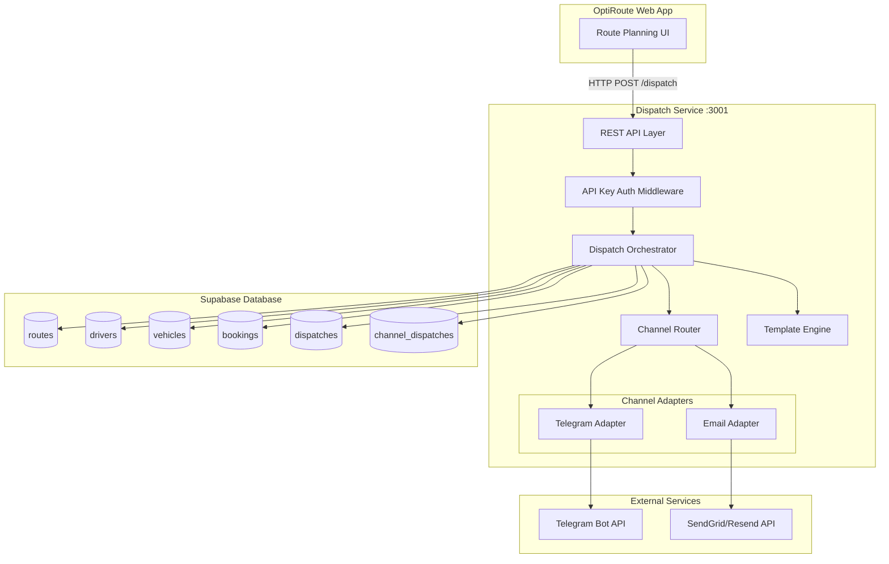
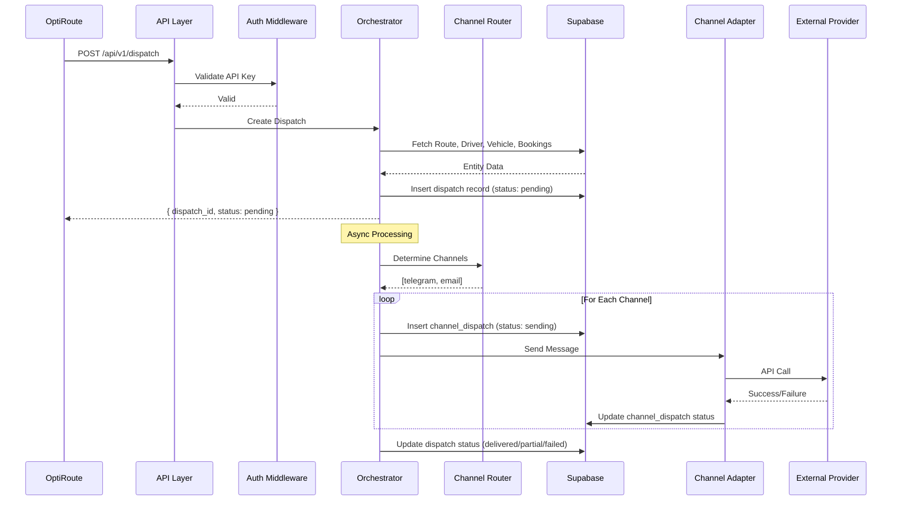

# Design Document: OptiRoute Dispatch Service

## Overview

The OptiRoute Dispatch Service is a standalone TypeScript/Node.js microservice that handles route assignment notifications to drivers. It operates as a second service within the existing DigitalOcean App Platform deployment, sharing the Supabase database with the main OptiRoute application.

The service follows a channel adapter architecture that allows for easy extension to new communication channels. For MVP, it supports Telegram (real-time notifications) and Email (detailed route information) channels.

### Key Design Decisions

1. **Standalone Service**: Deployed as a separate service on port 3001 to maintain separation of concerns and independent scaling
2. **Shared Database**: Uses the same Supabase instance as OptiRoute for accessing route/driver/vehicle data and storing dispatch records
3. **Adapter Pattern**: Channel adapters implement a common interface for consistent behavior and easy extensibility
4. **Async Processing**: Dispatch requests return immediately with a dispatch_id; actual delivery happens asynchronously
5. **Template-Based Messages**: Handlebars templates allow customization without code changes

## Architecture



### Request Flow



## Components and Interfaces

### Channel Adapter Interface

All channel adapters implement this common interface:

```typescript
interface ChannelAdapter {
  readonly channelType: ChannelType;
  
  /**
   * Check if this adapter can send to the given driver
   */
  canSend(driver: Driver): boolean;
  
  /**
   * Send a dispatch message to the driver
   */
  send(context: DispatchContext): Promise<ChannelResult>;
  
  /**
   * Check adapter health/connectivity
   */
  healthCheck(): Promise<HealthStatus>;
}

interface DispatchContext {
  dispatch: Dispatch;
  driver: Driver;
  route: Route;
  vehicle: Vehicle | null;
  bookings: Booking[];
  template: string;
}

interface ChannelResult {
  success: boolean;
  channelType: ChannelType;
  providerMessageId?: string;
  error?: string;
  sentAt: Date;
}

interface HealthStatus {
  healthy: boolean;
  message?: string;
}

type ChannelType = 'telegram' | 'email' | 'sms' | 'push';
```

### Dispatch Orchestrator

The orchestrator coordinates the dispatch workflow:

```typescript
interface DispatchOrchestrator {
  /**
   * Process a single dispatch request
   */
  dispatch(request: DispatchRequest): Promise<DispatchResponse>;
  
  /**
   * Process multiple dispatch requests
   */
  dispatchBatch(requests: DispatchRequest[]): Promise<BatchDispatchResponse>;
  
  /**
   * Get dispatch status by ID
   */
  getDispatch(dispatchId: string): Promise<Dispatch | null>;
}

interface DispatchRequest {
  routeId: string;
  driverId: string;
  channels?: ChannelType[];      // Override channels
  multiChannel?: boolean;         // Send to all available
  metadata?: Record<string, any>; // Additional context
}

interface DispatchResponse {
  dispatchId: string;
  status: DispatchStatus;
  requestedChannels: ChannelType[];
}

interface BatchDispatchResponse {
  results: Array<{
    index: number;
    success: boolean;
    dispatchId?: string;
    error?: string;
  }>;
  summary: {
    total: number;
    successful: number;
    failed: number;
  };
}
```

### Channel Router

Determines which channels to use for a dispatch:

```typescript
interface ChannelRouter {
  /**
   * Determine channels for a dispatch based on request and driver preferences
   */
  resolveChannels(
    request: DispatchRequest,
    driver: Driver
  ): ChannelType[];
  
  /**
   * Get fallback channel if primary fails
   */
  getFallbackChannel(
    driver: Driver,
    failedChannel: ChannelType
  ): ChannelType | null;
}
```

### Template Engine

Renders message templates with dispatch data:

```typescript
interface TemplateEngine {
  /**
   * Render a template with the given context
   */
  render(templateName: string, context: TemplateContext): string;
  
  /**
   * Get available templates for a channel
   */
  getTemplates(channelType: ChannelType): string[];
}

interface TemplateContext {
  route: {
    name: string;
    code: string;
    date: string;
    plannedStartTime: string;
    plannedEndTime: string;
    totalStops: number;
    totalDistanceKm: number;
    totalDurationMinutes: number;
  };
  driver: {
    firstName: string;
    lastName: string;
    fullName: string;
  };
  vehicle: {
    name: string;
    licensePlate: string;
    make: string;
    model: string;
  } | null;
  bookings: Array<{
    stopNumber: number;
    clientName: string;
    address: string;
    scheduledTime: string;
    services: string;
    specialInstructions: string;
  }>;
  dispatchedAt: string;
}
```

### API Handlers

```typescript
// POST /api/v1/dispatch
interface SingleDispatchBody {
  route_id: string;
  driver_id: string;
  channels?: ChannelType[];
  multi_channel?: boolean;
  metadata?: Record<string, any>;
}

// POST /api/v1/dispatch/batch
interface BatchDispatchBody {
  dispatches: SingleDispatchBody[];
}

// GET /api/v1/dispatch/:id response
interface DispatchDetailResponse {
  id: string;
  route_id: string;
  driver_id: string;
  status: DispatchStatus;
  requested_channels: ChannelType[];
  channel_dispatches: Array<{
    channel: ChannelType;
    status: ChannelDispatchStatus;
    provider_message_id?: string;
    error_message?: string;
    sent_at?: string;
    delivered_at?: string;
  }>;
  created_at: string;
  updated_at: string;
}

// GET /api/v1/health response
interface HealthResponse {
  status: 'healthy' | 'degraded' | 'unhealthy';
  timestamp: string;
  checks: {
    database: { status: 'up' | 'down'; latencyMs?: number };
    telegram: { status: 'up' | 'down' | 'unconfigured' };
    email: { status: 'up' | 'down' | 'unconfigured' };
  };
}
```

## Data Models

### Database Schema

#### dispatches table

```sql
CREATE TABLE dispatches (
  id UUID PRIMARY KEY DEFAULT gen_random_uuid(),
  route_id UUID NOT NULL REFERENCES routes(id),
  driver_id UUID NOT NULL REFERENCES drivers(id),
  status VARCHAR(20) NOT NULL DEFAULT 'pending',
  requested_channels TEXT[] NOT NULL,
  metadata JSONB,
  created_at TIMESTAMPTZ NOT NULL DEFAULT NOW(),
  updated_at TIMESTAMPTZ NOT NULL DEFAULT NOW()
);

CREATE INDEX idx_dispatches_route_id ON dispatches(route_id);
CREATE INDEX idx_dispatches_driver_id ON dispatches(driver_id);
CREATE INDEX idx_dispatches_status ON dispatches(status);
CREATE INDEX idx_dispatches_created_at ON dispatches(created_at);
```

#### channel_dispatches table

```sql
CREATE TABLE channel_dispatches (
  id UUID PRIMARY KEY DEFAULT gen_random_uuid(),
  dispatch_id UUID NOT NULL REFERENCES dispatches(id) ON DELETE CASCADE,
  channel VARCHAR(20) NOT NULL,
  status VARCHAR(20) NOT NULL DEFAULT 'pending',
  provider_message_id VARCHAR(255),
  error_message TEXT,
  sent_at TIMESTAMPTZ,
  delivered_at TIMESTAMPTZ,
  created_at TIMESTAMPTZ NOT NULL DEFAULT NOW(),
  updated_at TIMESTAMPTZ NOT NULL DEFAULT NOW()
);

CREATE INDEX idx_channel_dispatches_dispatch_id ON channel_dispatches(dispatch_id);
CREATE INDEX idx_channel_dispatches_channel ON channel_dispatches(channel);
CREATE INDEX idx_channel_dispatches_status ON channel_dispatches(status);
```

#### Driver table additions (migration)

```sql
-- Add dispatch preference columns to existing drivers table
ALTER TABLE drivers 
  ADD COLUMN IF NOT EXISTS preferred_channel VARCHAR(20) DEFAULT 'telegram',
  ADD COLUMN IF NOT EXISTS fallback_enabled BOOLEAN DEFAULT true;

-- Note: telegram_chat_id and email columns already exist in drivers table
```

### TypeScript Types

```typescript
// Dispatch status values
type DispatchStatus = 
  | 'pending'     // Created, not yet processed
  | 'sending'     // Currently sending to channels
  | 'delivered'   // At least one channel succeeded
  | 'partial'     // Some channels succeeded, some failed
  | 'failed';     // All channels failed

// Channel dispatch status values
type ChannelDispatchStatus =
  | 'pending'     // Not yet attempted
  | 'sending'     // Currently sending
  | 'delivered'   // Successfully delivered
  | 'failed';     // Delivery failed

// Dispatch entity
interface Dispatch {
  id: string;
  routeId: string;
  driverId: string;
  status: DispatchStatus;
  requestedChannels: ChannelType[];
  metadata?: Record<string, any>;
  createdAt: Date;
  updatedAt: Date;
}

// Channel dispatch entity
interface ChannelDispatch {
  id: string;
  dispatchId: string;
  channel: ChannelType;
  status: ChannelDispatchStatus;
  providerMessageId?: string;
  errorMessage?: string;
  sentAt?: Date;
  deliveredAt?: Date;
  createdAt: Date;
  updatedAt: Date;
}

// Database row types (snake_case)
interface DispatchRow {
  id: string;
  route_id: string;
  driver_id: string;
  status: DispatchStatus;
  requested_channels: string[];
  metadata: Record<string, any> | null;
  created_at: string;
  updated_at: string;
}

interface ChannelDispatchRow {
  id: string;
  dispatch_id: string;
  channel: string;
  status: ChannelDispatchStatus;
  provider_message_id: string | null;
  error_message: string | null;
  sent_at: string | null;
  delivered_at: string | null;
  created_at: string;
  updated_at: string;
}
```


## Correctness Properties

*A property is a characteristic or behavior that should hold true across all valid executions of a system—essentially, a formal statement about what the system should do. Properties serve as the bridge between human-readable specifications and machine-verifiable correctness guarantees.*

### Property 1: Dispatch Creation Persistence

*For any* valid dispatch request with existing route_id and driver_id, creating a dispatch SHALL result in a dispatch record in the database with matching route_id, driver_id, and status 'pending'.

**Validates: Requirements 1.1, 8.1**

### Property 2: Channel Selection Priority

*For any* dispatch request and driver configuration, the channel selection SHALL follow the priority order: (1) request channel override if specified, (2) driver's preferred_channel if set, (3) system default 'telegram'. The selected channel(s) SHALL always match exactly one of these three sources.

**Validates: Requirements 1.2, 1.3, 6.1, 11.2**

### Property 3: Async Response Immediacy

*For any* dispatch request, the API response SHALL contain a dispatch_id and status before any channel delivery completes. The response time SHALL not depend on external provider response times.

**Validates: Requirements 1.4**

### Property 4: Invalid Entity Error Handling

*For any* dispatch request with a non-existent route_id or driver_id, the API SHALL return HTTP 404 with an error message identifying which entity was not found.

**Validates: Requirements 1.5, 3.3**

### Property 5: Request Validation

*For any* malformed dispatch request (missing required fields, invalid types, empty batch array), the API SHALL return HTTP 400 with validation error details before any database operations occur.

**Validates: Requirements 1.6, 2.5**

### Property 6: Batch Processing Completeness

*For any* batch dispatch request with N items (where 1 ≤ N ≤ 100), the response SHALL contain exactly N results, each with either a dispatch_id (success) or error message (failure), regardless of individual item success/failure.

**Validates: Requirements 2.1, 2.3, 2.4**

### Property 7: Batch Size Limit

*For any* batch dispatch request with more than 100 items, the API SHALL return HTTP 400 without processing any items.

**Validates: Requirements 2.6**

### Property 8: Dispatch Retrieval Consistency

*For any* dispatch that has been created, GET /api/v1/dispatch/:id SHALL return the dispatch with all channel_dispatch records, and the returned data SHALL match the database state.

**Validates: Requirements 3.1, 3.2**

### Property 9: Adapter Configuration Validation

*For any* channel adapter and driver, the adapter's canSend() method SHALL return true if and only if the driver has the required configuration (telegram_chat_id for Telegram, email for Email). Attempting to send without valid configuration SHALL result in a failure with descriptive error.

**Validates: Requirements 4.3, 5.3, 6.4**

### Property 10: Delivery Status Tracking

*For any* channel delivery attempt, the channel_dispatch record SHALL be updated to reflect the outcome: 'delivered' with provider_message_id on success, or 'failed' with error_message on failure. The parent dispatch status SHALL be updated to reflect aggregate channel outcomes.

**Validates: Requirements 4.2, 4.4, 5.2, 5.4, 8.3, 8.4**

### Property 11: Telegram Message Content

*For any* dispatch context with route, driver, and bookings data, the rendered Telegram message SHALL contain: route date, planned start time, total stops count, and at least one booking summary. The message SHALL use Markdown formatting.

**Validates: Requirements 4.5, 4.6**

### Property 12: Email Message Content

*For any* dispatch context with route, driver, vehicle, and bookings data, the rendered email SHALL contain: route name, route date, vehicle information (if assigned), and complete booking list with addresses and scheduled times. The email SHALL use HTML formatting.

**Validates: Requirements 5.5, 5.6**

### Property 13: Multi-Channel Dispatch

*For any* dispatch request with multi_channel: true and a driver with multiple configured channels, the dispatch SHALL create channel_dispatch records for ALL configured channels, and all channels SHALL be attempted.

**Validates: Requirements 6.2**

### Property 14: Fallback Channel Behavior

*For any* driver with fallback_enabled: true and multiple configured channels, if the primary channel fails, the dispatch SHALL attempt delivery through the next available channel. The fallback attempt SHALL be recorded as a separate channel_dispatch.

**Validates: Requirements 6.3**

### Property 15: Template Variable Substitution

*For any* template with {{variable}} placeholders and a valid template context, rendering SHALL replace all placeholders with corresponding values. Missing or null values SHALL be replaced with empty strings, never with literal "undefined" or "null".

**Validates: Requirements 7.1, 7.2, 7.3, 7.5**

### Property 16: Channel-Specific Templates

*For any* channel type, the template engine SHALL load and use the channel-specific template file (telegram.md for Telegram, email.html for Email).

**Validates: Requirements 7.4**

### Property 17: API Key Authentication

*For any* API request to protected endpoints, the request SHALL be rejected with HTTP 401 if the X-API-Key header is missing or contains an invalid key. Requests with any valid configured API key SHALL be processed.

**Validates: Requirements 9.1, 9.2, 9.3, 9.4**

### Property 18: Health Check Response Structure

*For any* GET request to /api/v1/health, the response SHALL include: status field ('healthy', 'degraded', or 'unhealthy'), database connectivity check, and channel adapter availability for each configured adapter.

**Validates: Requirements 10.1, 10.2**

### Property 19: Adapter Failure Resilience

*For any* dispatch where a channel adapter throws an exception, the dispatch service SHALL catch the exception, record the failure in channel_dispatches, and continue processing other channels without crashing.

**Validates: Requirements 12.3**

## Error Handling

### API Error Responses

All API errors follow a consistent format:

```typescript
interface ApiError {
  error: {
    code: string;
    message: string;
    details?: Record<string, any>;
  };
  requestId: string;
}
```

### Error Codes

| HTTP Status | Code | Description |
|-------------|------|-------------|
| 400 | VALIDATION_ERROR | Request body validation failed |
| 400 | EMPTY_BATCH | Batch dispatch array is empty |
| 400 | BATCH_TOO_LARGE | Batch exceeds 100 items |
| 401 | UNAUTHORIZED | Missing or invalid API key |
| 404 | ROUTE_NOT_FOUND | Route ID does not exist |
| 404 | DRIVER_NOT_FOUND | Driver ID does not exist |
| 404 | DISPATCH_NOT_FOUND | Dispatch ID does not exist |
| 500 | INTERNAL_ERROR | Unexpected server error |
| 503 | SERVICE_UNAVAILABLE | Critical dependency unavailable |

### Channel Adapter Error Handling

```typescript
// Adapter errors are caught and recorded, never thrown to caller
try {
  const result = await adapter.send(context);
  await updateChannelDispatch(channelDispatchId, {
    status: result.success ? 'delivered' : 'failed',
    providerMessageId: result.providerMessageId,
    errorMessage: result.error,
    deliveredAt: result.success ? new Date() : undefined
  });
} catch (error) {
  // Log error with context
  logger.error('Channel adapter error', {
    dispatchId: context.dispatch.id,
    channel: adapter.channelType,
    error: error.message
  });
  
  // Record failure in database
  await updateChannelDispatch(channelDispatchId, {
    status: 'failed',
    errorMessage: error.message
  });
}
```

### Dispatch Status Determination

```typescript
function determineDispatchStatus(channelResults: ChannelDispatch[]): DispatchStatus {
  const delivered = channelResults.filter(c => c.status === 'delivered').length;
  const failed = channelResults.filter(c => c.status === 'failed').length;
  const total = channelResults.length;
  
  if (delivered === total) return 'delivered';
  if (delivered > 0) return 'partial';
  if (failed === total) return 'failed';
  return 'sending'; // Still in progress
}
```

## Testing Strategy

### Dual Testing Approach

The dispatch service uses both unit tests and property-based tests for comprehensive coverage:

- **Unit tests**: Verify specific examples, edge cases, integration points, and error conditions
- **Property tests**: Verify universal properties across randomly generated inputs

### Property-Based Testing Configuration

- **Library**: fast-check (TypeScript property-based testing library)
- **Minimum iterations**: 100 per property test
- **Tag format**: `Feature: dispatch-service, Property N: {property_text}`

### Test Structure

```
dispatch-service/
├── tests/
│   ├── unit/
│   │   ├── api/
│   │   │   ├── dispatch.handler.test.ts
│   │   │   ├── health.handler.test.ts
│   │   │   └── middleware.test.ts
│   │   ├── core/
│   │   │   ├── orchestrator.test.ts
│   │   │   ├── router.test.ts
│   │   │   └── templates.test.ts
│   │   └── adapters/
│   │       ├── telegram.test.ts
│   │       └── email.test.ts
│   ├── property/
│   │   ├── channel-selection.property.test.ts
│   │   ├── dispatch-creation.property.test.ts
│   │   ├── template-rendering.property.test.ts
│   │   ├── batch-processing.property.test.ts
│   │   └── authentication.property.test.ts
│   ├── integration/
│   │   ├── dispatch-flow.test.ts
│   │   └── database.test.ts
│   └── fixtures/
│       ├── generators.ts
│       └── mocks.ts
```

### Property Test Examples

```typescript
// Feature: dispatch-service, Property 2: Channel Selection Priority
import * as fc from 'fast-check';

describe('Channel Selection Priority', () => {
  it('should follow priority: override > preference > default', () => {
    fc.assert(
      fc.property(
        arbitraryDispatchRequest(),
        arbitraryDriver(),
        (request, driver) => {
          const selected = channelRouter.resolveChannels(request, driver);
          
          if (request.channels?.length) {
            // Override takes priority
            expect(selected).toEqual(request.channels);
          } else if (driver.preferredChannel) {
            // Driver preference second
            expect(selected).toContain(driver.preferredChannel);
          } else {
            // Default to telegram
            expect(selected).toContain('telegram');
          }
        }
      ),
      { numRuns: 100 }
    );
  });
});

// Feature: dispatch-service, Property 15: Template Variable Substitution
describe('Template Variable Substitution', () => {
  it('should replace all variables without undefined/null literals', () => {
    fc.assert(
      fc.property(
        arbitraryTemplateContext(),
        (context) => {
          const rendered = templateEngine.render('telegram', context);
          
          // No unsubstituted variables
          expect(rendered).not.toMatch(/\{\{.*?\}\}/);
          // No literal undefined/null
          expect(rendered).not.toContain('undefined');
          expect(rendered).not.toContain('null');
        }
      ),
      { numRuns: 100 }
    );
  });
});
```

### Test Data Generators

```typescript
// tests/fixtures/generators.ts
import * as fc from 'fast-check';

export const arbitraryChannelType = () => 
  fc.constantFrom('telegram', 'email') as fc.Arbitrary<ChannelType>;

export const arbitraryDriver = () => fc.record({
  id: fc.uuid(),
  firstName: fc.string({ minLength: 1, maxLength: 50 }),
  lastName: fc.string({ minLength: 1, maxLength: 50 }),
  email: fc.option(fc.emailAddress()),
  telegramChatId: fc.option(fc.string({ minLength: 5, maxLength: 20 })),
  preferredChannel: fc.option(arbitraryChannelType()),
  fallbackEnabled: fc.boolean(),
  status: fc.constantFrom('active', 'inactive')
});

export const arbitraryDispatchRequest = () => fc.record({
  routeId: fc.uuid(),
  driverId: fc.uuid(),
  channels: fc.option(fc.array(arbitraryChannelType(), { minLength: 1, maxLength: 2 })),
  multiChannel: fc.option(fc.boolean())
});

export const arbitraryTemplateContext = () => fc.record({
  route: fc.record({
    name: fc.string({ minLength: 1 }),
    code: fc.option(fc.string()),
    date: fc.date().map(d => d.toISOString().split('T')[0]),
    plannedStartTime: fc.constantFrom('08:00', '09:00', '10:00'),
    totalStops: fc.integer({ min: 1, max: 50 })
  }),
  driver: fc.record({
    firstName: fc.string({ minLength: 1 }),
    lastName: fc.string({ minLength: 1 }),
    fullName: fc.string({ minLength: 1 })
  }),
  vehicle: fc.option(fc.record({
    name: fc.string({ minLength: 1 }),
    licensePlate: fc.option(fc.string())
  })),
  bookings: fc.array(fc.record({
    stopNumber: fc.integer({ min: 1 }),
    clientName: fc.string({ minLength: 1 }),
    address: fc.string({ minLength: 1 }),
    scheduledTime: fc.constantFrom('08:30', '09:15', '10:00')
  }), { minLength: 1, maxLength: 20 })
});
```

### Mocking External Services

```typescript
// tests/fixtures/mocks.ts

export const mockTelegramApi = {
  sendMessage: jest.fn().mockResolvedValue({
    ok: true,
    result: { message_id: 12345 }
  })
};

export const mockEmailProvider = {
  send: jest.fn().mockResolvedValue({
    id: 'msg_abc123',
    status: 'sent'
  })
};

export const mockSupabase = {
  from: jest.fn().mockReturnThis(),
  select: jest.fn().mockReturnThis(),
  insert: jest.fn().mockReturnThis(),
  update: jest.fn().mockReturnThis(),
  eq: jest.fn().mockReturnThis(),
  single: jest.fn()
};
```
